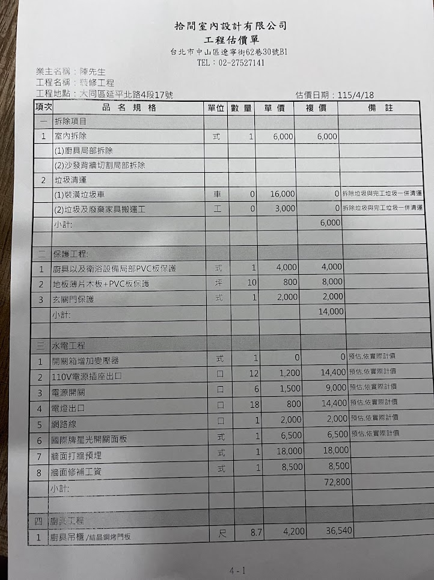
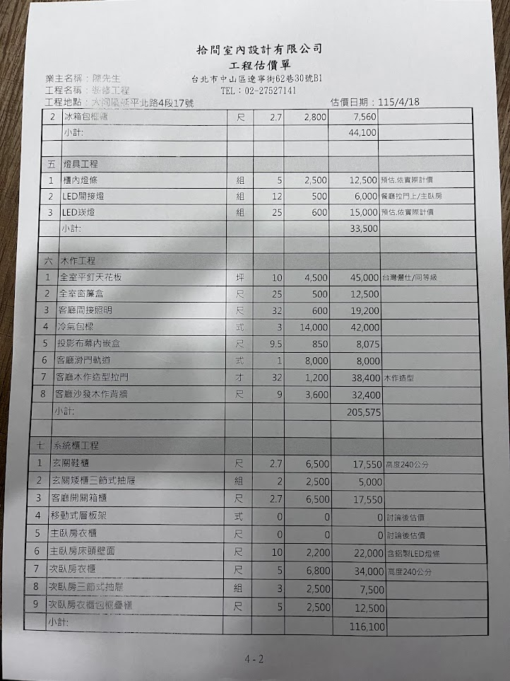
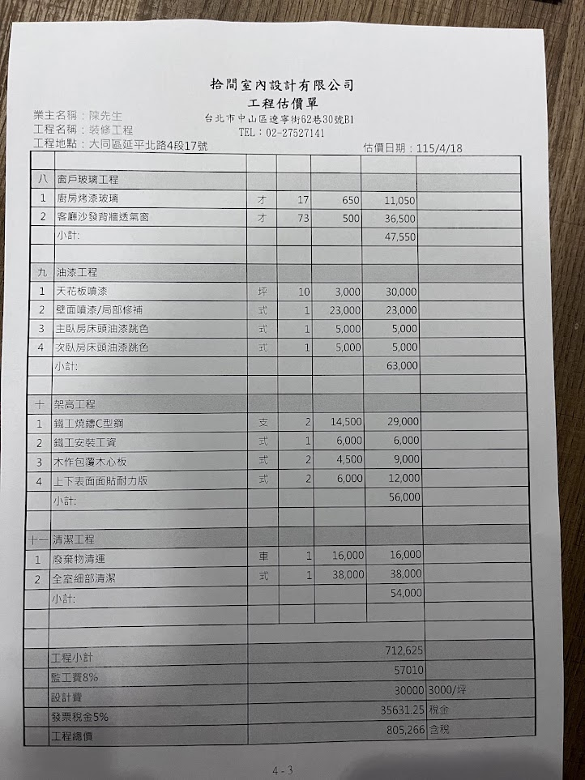

# 工程估價單
{: .no_toc }

  
目次

- TOC
{:toc}

## 估價單基本資訊

| 項目 | 內容 |
|---|---|
| 設計公司 | 拾間室內裝修設計有限公司 |
| 公司地址 | 台北市中山區遼寧街62巷30號 B1 |
| 電話 | 02-27527141 |
| 業主 | 陳先生 |
| 工程地點 | 大同區延平北路 4 段 17 號 |
| 工程名稱 | 裝修工程 |
| 估價日期 | 115/4/18（2026-04-18）|

## 分項小計

| 項次 | 工程類別 | 小計 (NT$) |
|---:|---|---:|
| 一 | 拆除項目 | 6,000 |
| 二 | 保護工程 | 14,000 |
| 三 | 水電工程 | 72,800 |
| 四 | 廚具工程 | 44,100 |
| 五 | 燈具工程 | 33,500 |
| 六 | 木作工程 | 205,575 |
| 七 | 系統櫃工程 | 116,100 |
| 八 | 窗戶玻璃工程 | 47,550 |
| 九 | 油漆工程 | 63,000 |
| 十 | 架高工程 | 56,000 |
| 十一 | 清潔工程 | 54,000 |

## 總計

| 項目 | 金額 (NT$) | 備註 |
|---|---:|---|
| 工程小計 | 712,625 | |
| 監工費 8% | 57,010 | |
| 設計費 | 30,000 | 3,000 / 坪 |
| 發票稅金 5% | 35,631 | |
| **工程總價（含稅）** | **805,266** | |

---

## 一、拆除項目

| # | 品名 | 單位 | 數量 | 單價 | 複價 | 備註 |
|---:|---|---|---:|---:|---:|---|
| 1 | 室內拆除（廚具局部、沙發背牆切割局部） | 式 | 1 | 6,000 | 6,000 | |
| 2-1 | 裝潢垃圾車 | 車 | 0 | 16,000 | 0 | 拆除垃圾與完工垃圾一併清運 |
| 2-2 | 垃圾及廢棄家具搬運工 | 工 | 0 | 3,000 | 0 | 同上 |
| | **小計** | | | | **6,000** | |

## 二、保護工程

| # | 品名 | 單位 | 數量 | 單價 | 複價 |
|---:|---|---|---:|---:|---:|
| 1 | 廚具/衛浴設備局部 PVC 板保護 | 式 | 1 | 4,000 | 4,000 |
| 2 | 地板薄片木板 + PVC 板保護 | 坪 | 10 | 800 | 8,000 |
| 3 | 玄關門保護 | 式 | 1 | 2,000 | 2,000 |
| | **小計** | | | | **14,000** |

## 三、水電工程

| # | 品名 | 單位 | 數量 | 單價 | 複價 | 備註 |
|---:|---|---|---:|---:|---:|---|
| 1 | 開關箱增加變壓器 | 式 | 1 | 0 | 0 | 預估，依實際計價 |
| 2 | 110V 電源插座出口 | 口 | 12 | 1,200 | 14,400 | 預估，依實際計價 |
| 3 | 電源開關 | 口 | 6 | 1,500 | 9,000 | |
| 4 | 電燈出口 | 口 | 18 | 800 | 14,400 | 預估，依實際計價 |
| 5 | 網路線 | 口 | 1 | 2,000 | 2,000 | |
| 6 | 國際牌星光開關面板 | 式 | 1 | 6,500 | 6,500 | 預估，依實際計價 |
| 7 | 牆面打鑿預埋 | 式 | 1 | 18,000 | 18,000 | |
| 8 | 牆面修補工資 | 式 | 1 | 8,500 | 8,500 | |
| | **小計** | | | | **72,800** | |

## 四、廚具工程

| # | 品名 | 單位 | 數量 | 單價 | 複價 |
|---:|---|---|---:|---:|---:|
| 1 | 廚具吊櫃 / 結晶鋼烤門板 | 尺 | 8.7 | 4,200 | 36,540 |
| 2 | 冰箱包框邊 | 尺 | 2.7 | 2,800 | 7,560 |
| | **小計** | | | | **44,100** |

## 五、燈具工程

| # | 品名 | 單位 | 數量 | 單價 | 複價 | 備註 |
|---:|---|---|---:|---:|---:|---|
| 1 | 櫃內燈條 | 組 | 5 | 2,500 | 12,500 | 預估，依實際計價 |
| 2 | LED 間接燈 | 組 | 12 | 500 | 6,000 | 餐廳拉門 / 主臥房 |
| 3 | LED 崁燈 | 組 | 25 | 600 | 15,000 | 預估，依實際計價 |
| | **小計** | | | | **33,500** | |

## 六、木作工程

| # | 品名 | 單位 | 數量 | 單價 | 複價 | 備註 |
|---:|---|---|---:|---:|---:|---|
| 1 | 全室平釘天花板 | 坪 | 10 | 4,500 | 45,000 | 台灣麗仕 / 同等級 |
| 2 | 全室窗簾盒 | 尺 | 25 | 500 | 12,500 | |
| 3 | 客廳間接照明 | 尺 | 32 | 600 | 19,200 | |
| 4 | 冷氣包樑 | 式 | 3 | 14,000 | 42,000 | |
| 5 | 投影布幕內嵌盒 | 尺 | 9.5 | 850 | 8,075 | |
| 6 | 客廳滑門軌道 | 式 | 1 | 8,000 | 8,000 | |
| 7 | 客廳木作造型拉門 | 才 | 32 | 1,200 | 38,400 | 木作造型 |
| 8 | 客廳沙發木作背牆 | 才 | 9 | 3,600 | 32,400 | |
| | **小計** | | | | **205,575** | |

## 七、系統櫃工程

| # | 品名 | 單位 | 數量 | 單價 | 複價 | 備註 |
|---:|---|---|---:|---:|---:|---|
| 1 | 玄關鞋櫃 | 尺 | 2.7 | 6,500 | 17,550 | 高度 240 公分 |
| 2 | 玄關矮櫃三節式抽屜 | 組 | 2 | 2,500 | 5,000 | |
| 3 | 客廳開關箱門 | 尺 | 2.7 | 6,500 | 17,550 | |
| 4 | 移動式層板架 | 式 | 0 | 0 | 0 | 討論後估價 |
| 5 | 主臥房衣櫃 | 式 | 0 | 0 | 0 | 討論後估價 |
| 6 | 主臥房床頭壁面 | 尺 | 10 | 2,200 | 22,000 | 含鋁製 LED 燈條 |
| 7 | 次臥房衣櫃 | 尺 | 5 | 6,800 | 34,000 | 高度 240 公分 |
| 8 | 次臥房三節式抽屜 | 組 | 3 | 2,500 | 7,500 | |
| 9 | 次臥房衣櫃包框折疊櫃 | 尺 | 5 | 2,500 | 12,500 | |
| | **小計** | | | | **116,100** | |

## 八、窗戶玻璃工程

| # | 品名 | 單位 | 數量 | 單價 | 複價 |
|---:|---|---|---:|---:|---:|
| 1 | 廚房烤漆玻璃 | 才 | 17 | 650 | 11,050 |
| 2 | 客廳沙發背牆透氣窗 | 才 | 73 | 500 | 36,500 |
| | **小計** | | | | **47,550** |

## 九、油漆工程

| # | 品名 | 單位 | 數量 | 單價 | 複價 |
|---:|---|---|---:|---:|---:|
| 1 | 天花板噴漆 | 坪 | 10 | 3,000 | 30,000 |
| 2 | 壁面噴漆 / 局部修補 | 式 | 1 | 23,000 | 23,000 |
| 3 | 主臥房床頭油漆跳色 | 式 | 1 | 5,000 | 5,000 |
| 4 | 次臥房床頭油漆跳色 | 式 | 1 | 5,000 | 5,000 |
| | **小計** | | | | **63,000** |

## 十、架高工程

**用途**：[C 房](../rooms/C.md) 架高夾層 — **上層為儲藏空間**（置物），**下層為床 + 書桌**（[KL Board 壁掛翻轉床](../references/products/#kl-board--壁掛翻轉床--書桌murphy-bed) 裝在 [CW 牆](../walls/CW.md)）。

| # | 品名 | 單位 | 數量 | 單價 | 複價 |
|---:|---|---|---:|---:|---:|
| 1 | 鐵工燒鑄 C 型鋼 | 支 | 2 | 14,500 | 29,000 |
| 2 | 鐵工安裝工資 | 式 | 1 | 6,000 | 6,000 |
| 3 | 木作包覆木心板 | 式 | 2 | 4,500 | 9,000 |
| 4 | 上下表面面貼耐力版 | 式 | 2 | 6,000 | 12,000 |
| | **小計** | | | | **56,000** |

## 十一、清潔工程

| # | 品名 | 單位 | 數量 | 單價 | 複價 |
|---:|---|---|---:|---:|---:|
| 1 | 廢棄物清運 | 車 | 1 | 16,000 | 16,000 |
| 2 | 全室細部清潔 | 式 | 1 | 38,000 | 38,000 |
| | **小計** | | | | **54,000** |

---

## 原始掃描

{: .hover-lightbox-trigger width="500" }
{: .hover-lightbox-trigger width="500" }
{: .hover-lightbox-trigger width="500" }

## 待確認 / 未定價項目

- [ ] 系統櫃七-4：移動式層板架（討論後估價）
- [ ] 系統櫃七-5：主臥房衣櫃（討論後估價）
- [ ] 水電幾項標註「預估依實際計價」 — 開關箱變壓器、110V 出口、電燈出口、國際牌面板
- [ ] 燈具都標「預估」 — 櫃內燈條、LED 崁燈
- [x] ~~架高工程是否為 C 房夾層 / 書桌區？~~ — **確認：C 房架高夾層，上層儲藏、下層為床 + 書桌**
