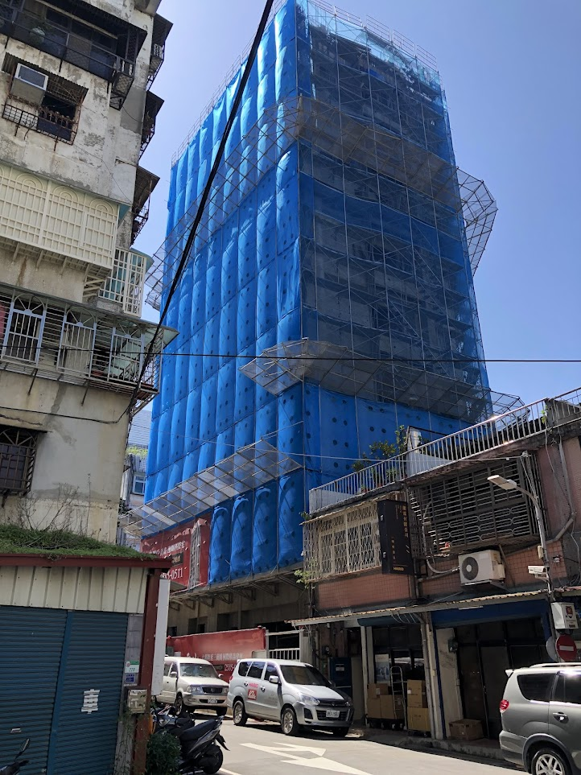
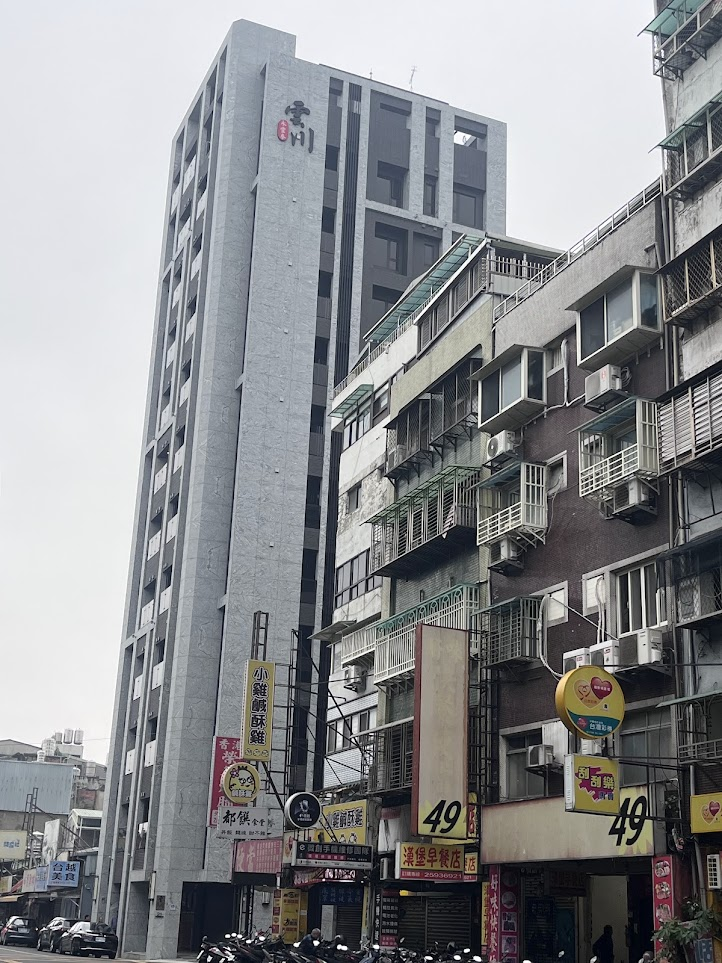
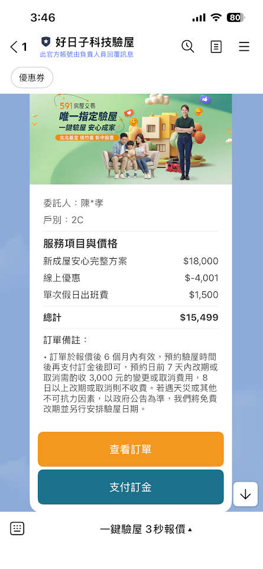

# 合約文件

## 概況

| 項目 | 內容 |
|---|---|
| 設計公司 | 拾間室內裝修設計有限公司 |
| 公司地址 | 台北市中山區遼寧街62巷30號 B1 · TEL 02-27527141 |
| 業主 | 陳先生 |
| 工程地點 | 大同區延平北路 4 段 17 號 |
| 估價日期 | 2026-04-18 (民國 115/4/18) |

### 專案里程碑

| 日期 | 事件 |
|---|---|
| 2024-05-09 | [購屋簽約](#2024-05-09--購屋簽約) |
| 2026-03-02 | 建築水電圖完成（交屋期） |
| 2026-03-29 | [第一次驗屋 + 設計師現場丈量](#2026-03-29--第一次驗屋--設計師現場丈量) |
| 2026-03-29 | [合豐家具訂單 60646 訂金付款](#2026-03-29--合豐家具訂單-60646) |
| 2026-04-18 | 裝修估價單（拾間設計）|

#### 2024-05-09 · 購屋簽約

{: .hover-lightbox-trigger width="400" }

簽約當天建物仍在施工中，外層覆蓋藍色保護網 / 鷹架。

#### 2026-03-29 · 第一次驗屋 + 設計師現場丈量

{: .hover-lightbox-trigger width="400" }

建物已完工交屋，拾間設計師同場進行現場丈量為裝修估價做準備。

**驗屋服務**（好日子科技驗屋 · 戶別 2C）

| 項目 | 金額 (NT$) |
|---|---:|
| 新成屋安心完整方案 | 18,000 |
| 線上優惠 | −4,001 |
| 單次假日出班費 | 1,500 |
| **總計** | **15,499** |

訂單有效期 6 個月；預約日前 7 天內改期或取消需收 NT$3,000 費用，8 日以上改期或取消不收費。

{: .hover-lightbox-trigger width="300" }

#### 2026-03-29 · 合豐家具訂單 60646

**禾豐（合豐）家具有限公司** · 訂單編號 **60646** · 訂購日 2026-03-29

| # | 品名 | 配色 / 備註 | 數量 | 單價 (NT$) |
|---:|---|---|---:|---:|
| 1 | [TA-175 升降茶几 / 餐桌](../references/products/#ta-175--多功能升降茶几--餐桌) | 配色代號待辨識 | 1 | 138,000 |
| 2 | [KL 120 Board](../references/products/#kl-board--壁掛翻轉床--書桌murphy-bed) | MB1 / LAZIO | 1 | 154,000 |
| 3 | KL 120 床頭片（選配） | FINLAND | 1 | 22,200 |
| 4 | [LD002 壁掛翻轉床（雙人）](../references/products/#ld002--壁掛翻轉床雙人--移動式桌--書櫃) | NOCE / DESERTO | 1 | 407,000 |
| 5 | LD002 床頭片（選配） | PLUM | 1 | 14,500 |
| | **總計** | | | **735,700** |

**付款 / 交期**：

| 項目 | 金額 (NT$) | 狀態 |
|---|---:|---|
| 訂金 50% | 368,000 | **已付 2026-03-29** |
| 尾款 50% | 367,700 | 交貨時付 |
| 交期 | | **訂金起算 6–8 個月** → 2026-09-29 ~ 2026-11-29 到貨 |

**未加購選配**：KL 120 LED / 原廠床墊；LD002 雙側 LED / 雙側 USB / 原廠床墊。

訂單原件掃描含姓名 / 電話 / 地址，保存於 `docs/contract/private/hefeng-order-60646-2026-03-29.png`（本地）。

### 設計師資格

建築物室內裝修工程管理 **乙級技術士證** — 邱ＸＸ（113/04/24 發證）
{: .fs-3 }

*（證件掃描含國民身分證號碼，僅保存於本地 `docs/contract/private/`，未公開發佈）*

## 報價總覽

| 項目 | 金額 (NT$) |
|---|---:|
| 工程小計 | 712,625 |
| 監工費 8% | 57,010 |
| 設計費 (3,000/坪 × 10 坪) | 30,000 |
| 發票稅金 5% | 35,631 |
| **工程總價（含稅）** | **805,266** |

詳見 [工程估價單](./estimate) — 每一個分項都有完整明細。

## 付款節奏

### 設計階段
50% 簽約 → 50% 設計交圖

### 工程階段
20% 訂金 → 25% 拆除 → 25% 裝修 → 25% 系統櫃 → 5% 驗收

詳見 [設計流程與付款](./process)

## 源檔 (建築水電圖)

- [建築水電圖 115.03.02 (DWG)](./source/2F_C戶-雲川-建築水電圖-115.03.02.dwg)
- [建築水電圖 115.03.02 (PDF)](./source/2F_C戶-雲川-建築水電圖-115.03.02.pdf)

## 保固

- 工程保固：**1 年**，依報價單內容所列
- 售後：結案後第 11 個月電訪

## 變更紀錄

尚未有變更紀錄。新增方式：複製 [`_change-template.md`](./_change-template) 改名為 `change-NNN.md`。
