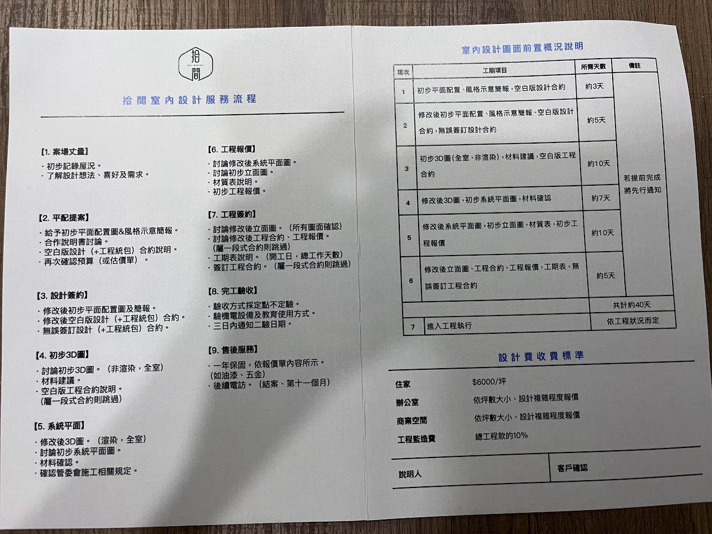
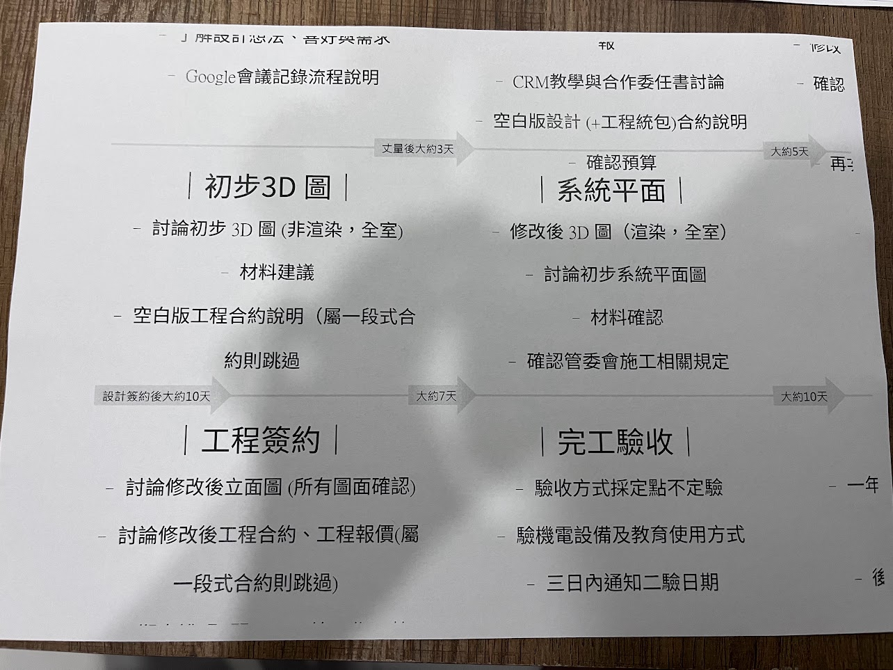
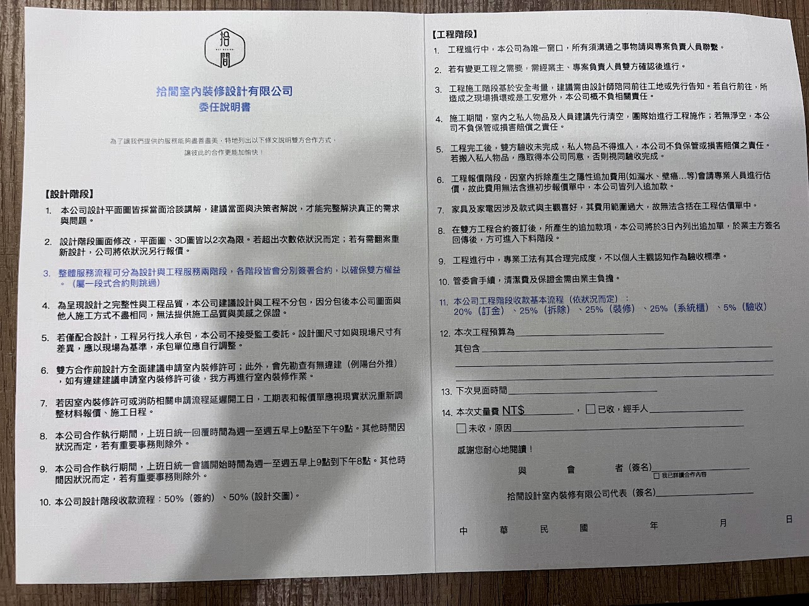

# 設計流程、付款與合約條款
{: .no_toc }

  
目次

- TOC
{:toc}

## 設計費 / 監工費

| 項目 | 費率 |
|---|---|
| 住家設計費 | NT$6,000 / 坪 |
| 辦公室 / 商業空間 | 依坪數大小、設計複雜程度報價 |
| 工程監造費 | 總工程款的 10% |

## 設計階段 9 步流程

| # | 階段 | 內容 | 所需天數 |
|---:|---|---|---|
| 1 | 索場丈量 | 初步記錄屋況、了解設計想法、喜好及需求 | — |
| 2 | 平配提案 | 初步平面配置 + 風格示意簡報 / 合作說明書 / 空白版設計合約 / 估價單 | 約 3 天 |
| 3 | 設計簽約 | 修改後平面與簡報、修改後空白版設計合約（+ 工程統包）、無誤簽訂 | 約 5 天 |
| 4 | 初步 3D 圖 | 全室非渲染 3D、材料建議、空白版工程合約 | 約 10 天 |
| 5 | 系統平面 | 修改後 3D（渲染）、初步系統平面圖、材料確認、管委會規定確認 | 約 7 天 |
| 6 | 工程報價 | 修改後系統平面圖、初步立面圖、材質表、初步工程報價 | 約 10 天 |
| 7 | 工程簽約 | 修改後立面圖（所有圖面確認）、工程合約 / 報價、工期表、無誤簽訂 | 約 5 天 |
| 8 | 完工驗收 | 採定點不定驗方式、驗機電設備 + 教育使用方式、3 日內通知二驗日期 | 依工程而定 |
| 9 | 售後服務 | 一年保固（依報價單內容）、後續電訪（結案後第 11 個月）| — |

**設計階段總長**：約 40 天（若提前完成將先行通知）

## 付款條件

### 設計階段

| 階段 | 比例 |
|---|---:|
| 簽約 | 50% |
| 設計交圖 | 50% |

### 工程階段（依狀況而定）

| 階段 | 比例 |
|---|---:|
| 訂金 | 20% |
| 拆除 | 25% |
| 裝修 | 25% |
| 系統櫃 | 25% |
| 驗收 | 5% |

## 委任說明書重點條款

### 設計階段

- 平面圖皆面對面洽談講解 — 建議決策者同場討論
- 平面圖與 3D 圖各修改 **2 次為限**；超過依狀況另行報價
- 整體服務分「設計」與「工程」兩階段，各自簽約
- 若配合設計但工程另找人承包，公司不接受監工委託；設計圖僅供參考
- 設計階段款：50% 簽約 + 50% 設計交圖
- 雙方上班日回覆：週一～週五 09:00–21:00
- 雙方上班日會議開始：週一～週五 09:00–20:00

### 工程階段

- 本公司為唯一窗口，所有事項請與專案負責人聯繫
- 變更工程需雙方確認後進行
- 施工期間建議清空私人物品；未清空不負保管或損害賠償責任
- 工程完工後驗收未完成前，私人物品不得進入
- 隱性追加（漏水、壁癌等）無法含在報價單中，會請專業人員估價後列入追加款
- 家具、家電等依款式與主觀喜好無法含在工程估價
- 追加項目需於雙方工程合約簽訂後於 3 日內列出追加單
- 管委會手續、清潔費、保證金由業主負擔

## 原始掃描

{: .hover-lightbox-trigger width="600" }

{: .hover-lightbox-trigger width="600" }

{: .hover-lightbox-trigger width="600" }
