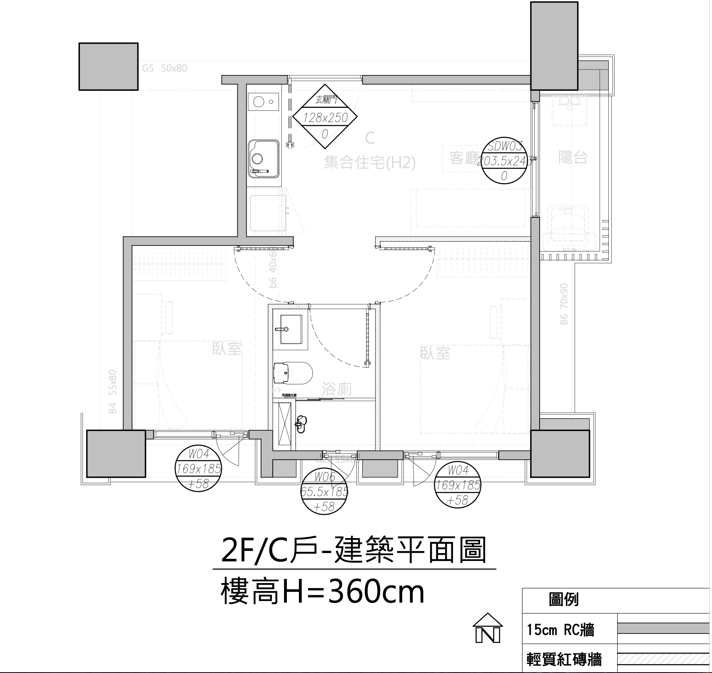

# 2F/C戶 · 雲川集合住宅
{: .fs-8 }

裝修細節工作區 — 收集合約條款、每面牆的細部決策、參考產品與靈感圖，方便與設計師討論對齊。
{: .fs-5 .fw-300 }

[合約文件](./contract/){: .btn .btn-primary .mr-2 }
[每面牆](./walls/){: .btn .mr-2 }
[房間](./rooms/){: .btn .mr-2 }
[參考](./references/){: .btn }

---

## 房間 / 牆面命名

以房間代號 + 方位命名，共 4 房 × 4 牆 = 16 面牆。

| 房間 | 代號 | 用途 |
|---|---|---|
| A | 客廳 + 廚房 | 公共區 (含陽台側) |
| B | 主臥房 | 東側 |
| C | 次臥房 | 西側 |
| D | 衛浴 | 中央 |

方位：**N** 北 / **E** 東 / **S** 南 / **W** 西 → 例：`AN` = A 房北牆、`BW` = 主臥西牆。

## 平面概略

<svg viewBox="0 0 800 500" xmlns="http://www.w3.org/2000/svg" role="img" aria-label="2F/C戶 平面圖" style="width: 100%; height: auto; font-family: system-ui, -apple-system, 'PingFang TC', sans-serif;">
  <rect x="0" y="0" width="800" height="500" fill="#fafafa"/>

  <!-- North arrow -->
  <g transform="translate(750, 40)">
    <text x="0" y="0" text-anchor="middle" font-size="14" font-weight="bold" fill="#666">N</text>
    <line x1="0" y1="10" x2="0" y2="35" stroke="#666" stroke-width="2"/>
    <polygon points="0,5 -5,15 5,15" fill="#666"/>
  </g>

  <!-- Building outline (L-shape) -->
  <path d="M 240,60 L 640,60 L 640,440 L 60,440 L 60,230 L 240,230 Z"
        fill="none" stroke="#333" stroke-width="3"/>

  <!-- Room A (客廳 + 廚房) -->
  <rect x="240" y="60" width="400" height="170" fill="#E3F2FD" stroke="#333" stroke-width="1.5"/>
  <line x1="400" y1="60" x2="400" y2="230" stroke="#999" stroke-width="1" stroke-dasharray="4,3"/>
  <text x="440" y="130" text-anchor="middle" font-size="22" font-weight="bold" fill="#1565C0">A</text>
  <text x="440" y="150" text-anchor="middle" font-size="13" fill="#333">客廳 + 廚房</text>
  <text x="320" y="195" text-anchor="middle" font-size="11" fill="#666" font-style="italic">廚房</text>
  <text x="525" y="195" text-anchor="middle" font-size="11" fill="#666" font-style="italic">客廳</text>

  <!-- 陽台 (outside AE, same N-S extent as A) -->
  <rect x="645" y="60" width="60" height="170" fill="#F5F5F5" stroke="#999" stroke-width="1.5" stroke-dasharray="4,3"/>
  <text x="675" y="140" text-anchor="middle" font-size="11" fill="#555">陽台</text>
  <text x="675" y="155" text-anchor="middle" font-size="9" fill="#999">(戶外)</text>

  <!-- Room C (次臥) -->
  <rect x="60" y="230" width="200" height="210" fill="#F3E5F5" stroke="#333" stroke-width="1.5"/>
  <text x="160" y="330" text-anchor="middle" font-size="22" font-weight="bold" fill="#6A1B9A">C</text>
  <text x="160" y="350" text-anchor="middle" font-size="13" fill="#333">次臥</text>

  <!-- Alley 走廊 -->
  <rect x="260" y="230" width="130" height="40" fill="#FFF9C4" stroke="#333" stroke-width="1.5"/>
  <text x="325" y="256" text-anchor="middle" font-size="11" fill="#795548" font-style="italic">走廊</text>

  <!-- Room D (衛浴) — shorter N-S -->
  <rect x="260" y="270" width="130" height="170" fill="#E0F7FA" stroke="#333" stroke-width="1.5"/>
  <text x="325" y="345" text-anchor="middle" font-size="22" font-weight="bold" fill="#00695C">D</text>
  <text x="325" y="365" text-anchor="middle" font-size="13" fill="#333">衛浴</text>

  <!-- Room B (主臥) -->
  <rect x="390" y="230" width="250" height="210" fill="#E8F5E9" stroke="#333" stroke-width="1.5"/>
  <text x="515" y="330" text-anchor="middle" font-size="22" font-weight="bold" fill="#2E7D32">B</text>
  <text x="515" y="350" text-anchor="middle" font-size="13" fill="#333">主臥</text>

  <!-- Wall labels -->
  <g font-size="12" fill="#0D47A1" font-weight="600">
    <text x="440" y="50" text-anchor="middle">AN</text>
    <text x="648" y="150" text-anchor="start">AE</text>
    <text x="440" y="223" text-anchor="middle">AS</text>
    <text x="232" y="150" text-anchor="end">AW</text>

    <text x="515" y="245" text-anchor="middle">BN</text>
    <text x="648" y="340" text-anchor="start">BE</text>
    <text x="515" y="458" text-anchor="middle">BS</text>
    <text x="398" y="340" text-anchor="start">BW</text>

    <text x="160" y="223" text-anchor="middle">CN</text>
    <text x="252" y="340" text-anchor="end">CE</text>
    <text x="160" y="458" text-anchor="middle">CS</text>
    <text x="52" y="340" text-anchor="end">CW</text>

    <text x="325" y="285" text-anchor="middle" font-size="10">DN</text>
    <text x="384" y="315" text-anchor="end" font-size="10">DE</text>
    <text x="325" y="458" text-anchor="middle">DS</text>
    <text x="266" y="315" text-anchor="start" font-size="10">DW</text>
  </g>
</svg>

### 空間關係

- **A 房** 寬度 ≈ **D + B**（A 只佔北側的 D + B 上方，不涵蓋 C 上方）
- **C 房向西突出**：全棟總寬 **C + D + B > A**（L 形）
- **C 寬度 > D 寬度**
- **D 南北深度 < C 和 B**：D 較短，北側留出空間給走廊
- **走廊**（黃色帶）位於 D 北側 — C 可經走廊直接通到 B，不必穿過衛浴
- **南牆共線**：CS、DS、BS 同一水平線
- **陽台** 位於 AE 牆外側（戶外）

### 真實建築平面圖（比例參考）

{: .hover-lightbox-trigger width="600" }

樓高 **H = 360 cm**，RC 牆 15 cm。完整合約圖面在 [合約文件](./contract/)。

## 快速導覽

| 區塊 | 用途 |
|---|---|
| [合約文件](./contract/) | 合約掃描、條款備註、設計圖源檔 |
| [每面牆](./walls/) | 16 面牆每面一頁 — 尺寸、插座、櫃體、燈具、照片 |
| [房間](./rooms/) | A/B/C/D 四房整合視角 — 地坪、天花、燈光配置 |
| [參考](./references/) | 參考產品連結、靈感圖、色卡 |

## 使用方式

- **上傳圖片**：丟到 `docs/assets/images/<主題>/`，用 `` 引用（相對路徑 — 從 `walls/`、`rooms/` 等子資料夾的頁面往上一層）
- **修改牆面頁**：直接編輯 `walls/<代號>.md`（如 `walls/AN.md`）
- **新增變更單**：複製 `contract/_change-template.md`
- **與設計師分享**：整份網站發佈到 GitHub Pages，直接丟連結
