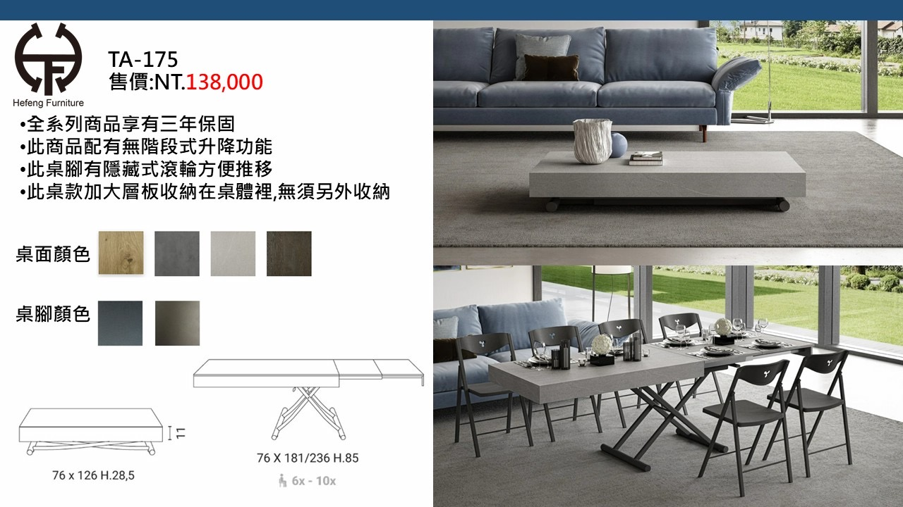
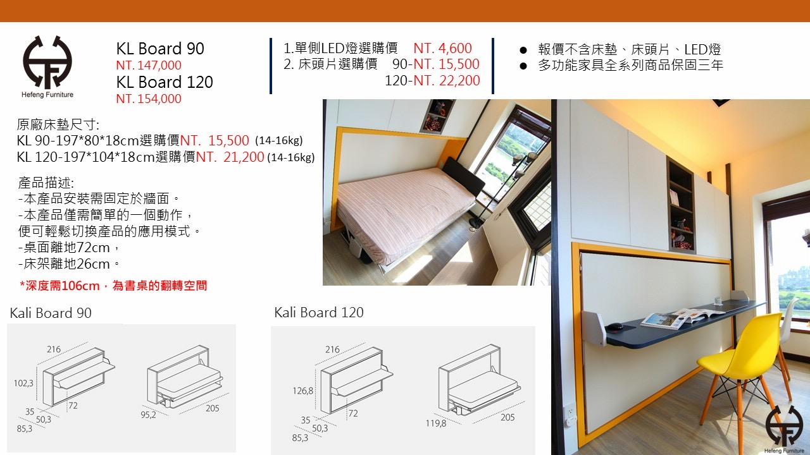
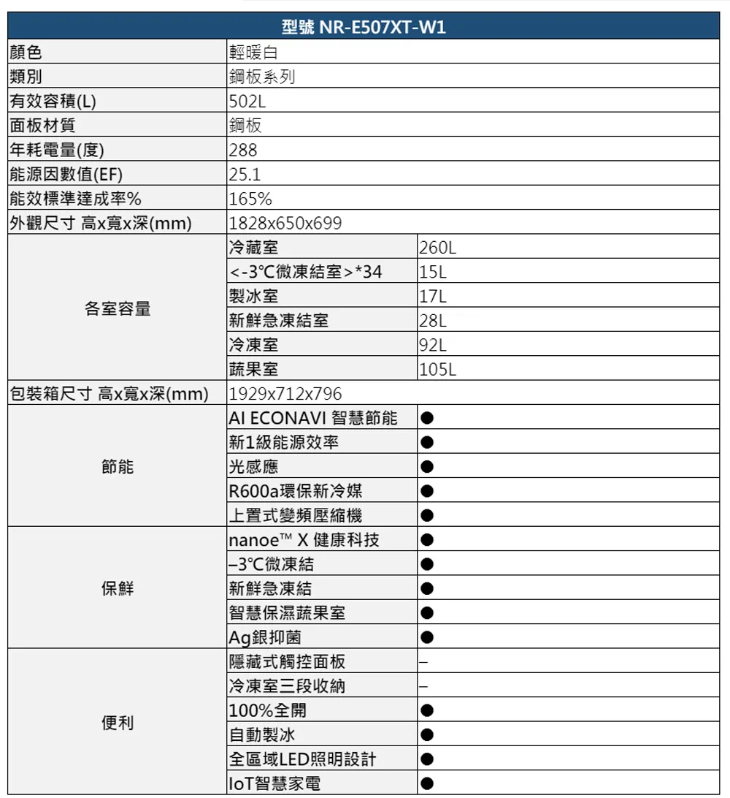
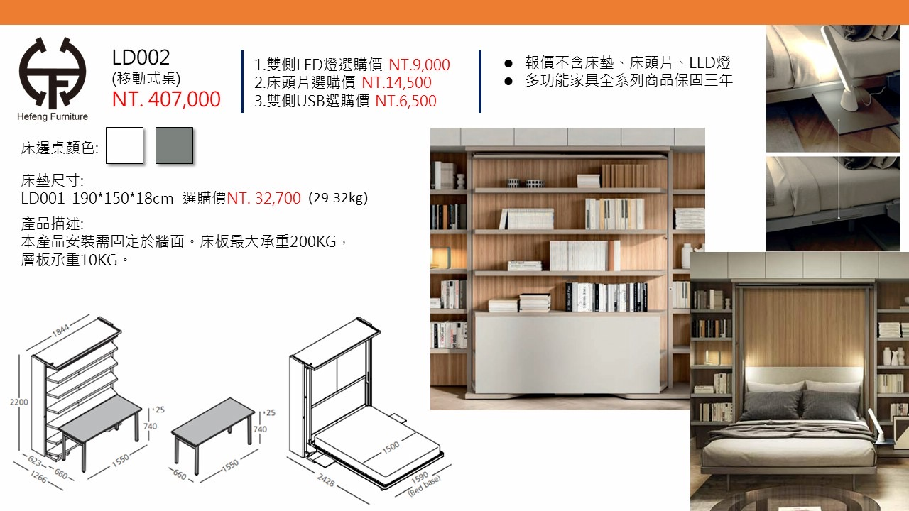

# 產品
{: .no_toc }

  
目次

- TOC
{:toc}

## 已購

### TA-175 · 多功能升降茶几 / 餐桌

**合豐家具 Hefeng Furniture** · NT$138,000 · 用於 **[A 房 · 客廳](../rooms/A.md)**

{: .hover-lightbox-trigger }

| 項目 | 內容 |
|---|---|
| 茶几模式 | 76 × 126 × H28.5 cm |
| 餐桌模式 | 76 × 181 / 236 × H85 cm（6–10 人） |
| 機構 | 無階段式升降、桌腳隱藏式滾輪 |
| 收納 | 桌體內加大層板，無須外部收納 |
| 保固 | 3 年（全系列） |
| 桌面顏色 | 4 色可選（橡木 / 灰 / 淺米 / 深胡桃）— **待確認** |
| 桌腳顏色 | 2 色可選（深藍灰 / 古銅）— **待確認** |

**備註**：升降功能可從茶几高度一鍵變成正規餐桌，桌板展開 126→181→236 cm，適合公寓彈性使用。

**已訂**（[合豐訂單 60646 · 2026-03-29](../contract/#2026-03-29--合豐家具訂單-60646)）— 訂金 50% 已付，**預計 2026-09-29 ~ 2026-11-29 到貨**。

- [ ] 桌面與桌腳最終配色（訂單備註字跡為 `IMLED` / `IMOLA` 之類 — 需回合豐再次確認）
- [ ] 電梯 / 樓梯搬運評估（展開後 236 cm 長）

---

### KL Board · 壁掛翻轉床 / 書桌（Murphy Bed）

**合豐家具 Hefeng Furniture** · 用於 **[C 房 · 次臥](../rooms/C.md)** · [CW 牆](../walls/CW.md)

{: .hover-lightbox-trigger }

床收起時變書桌，翻下變床，壁掛固定。兩種尺寸可選：

| 尺寸 | 床墊規格 | 床身本體 | 主體價格 |
|---|---|---|---|
| **KL Board 90**（單人） | 197 × 80 × 18 cm | 216 × H102.3 × D85.3 | NT$147,000 |
| **KL Board 120**（加大單人） | 197 × 104 × 18 cm | 216 × H126.8 × D85.3 | NT$154,000 |

**選配**（均另計）：

| 選配 | KL 90 | KL 120 |
|---|---|---|
| 單側 LED 燈 | NT$4,600 | NT$4,600 |
| 床頭片 | NT$15,500 | NT$22,200 |
| 原廠床墊 | NT$15,500 | NT$21,200 |

**關鍵尺寸**：
- 翻轉後床架離地 **26 cm**、書桌面離地 **72 cm**
- 需預留 **深度 106 cm** 作為書桌翻轉空間（⚠️ 含書桌翻轉淨空）
- 床架未展開 205 cm、展開後佔深度 95.2 cm (KL90) / 119.8 cm (KL120)

**已訂**（[合豐訂單 60646 · 2026-03-29](../contract/#2026-03-29--合豐家具訂單-60646)）：

- ✅ **選 KL 120**（加大單人）
- ✅ **加購床頭片** NT$22,200 · 配色 `FINLAND`
- ✅ 本體配色 `MB1 / LAZIO`
- ❌ 未加購：單側 LED 燈、原廠床墊
- 訂金 50% 已付，**預計 2026-09-29 ~ 2026-11-29 到貨**

**待確認**：
- [ ] 安裝牆體結構是否能承重（RC 牆需膨脹螺絲 / 輕隔間需加背板）
- [ ] 上層儲藏夾層與 CW 附近儲藏隔間的整合方式

---

### Panasonic NR-E507XT-W1 · 502L 日製五門變頻冰箱（輕暖白）

**燦坤 3C（TK3C）提貨券已購** · NT$47,872 · 用於 **[A 房 · 廚房 AW](../walls/AW.md)**（靠 AS 側）

{: .hover-lightbox-trigger width="500" }

| 項目 | 內容 |
|---|---|
| 型號 | **NR-E507XT-W1**（輕暖白 / 鋼板系列） |
| 外觀尺寸 (高 × 寬 × 深) | **1828 × 650 × 699 mm** |
| 包裝箱尺寸 (高 × 寬 × 深) | **1929 × 712 × 796 mm** — 搬運動線需符合此尺寸 |
| 有效容積 | 502 L |
| 各室 | 冷藏 260 / 微凍 15 / 製冰 17 / 新鮮急凍 28 / 冷凍 92 / 蔬果 105 L |
| 節能 | 新 1 級能效（達成率 165%）、AI ECONAVI、288 度/年、R600a、上置式變頻壓縮機 |
| 保鮮 | nanoe™ X、−3°C 微凍結、新鮮急凍結、智慧保濕蔬果室、Ag 銀抑菌 |
| 便利 | 100% 全開、自動製冰、全區域 LED、IoT 智慧家電 |

**購買**：

| 項目 | 內容 |
|---|---|
| 購買方式 | TK3C 提貨券（面額 NT$47,872） |
| 發券日 | 2023/09 |
| 信託有效期 | **2026/01/07 – 2027/01/07**（務必在此區間換貨提領） |

**待確認**：
- [ ] 冰箱後方散熱縫隙 5–10 cm 且**接天花板新風通道**（見 [AW](../walls/AW.md)）
- [ ] 散熱通道需**防貓網**避免貓鑽入冰箱後
- [ ] 電源插座位置（冰箱專用迴路），配合 AW 靠 AS 側角落
- [ ] **在提貨券到期前（2027/01/07）換貨**
- [ ] 搬運動線確認 — 電梯內徑、廚房入口寬度是否能容納**包裝箱 W712 × D796 × H1929 mm**
- [ ] 門開方向與對開 / 左右開規格（AW 靠 AS 側配置 → 門朝 AS 方向開啟）

---

### LD002 · 壁掛翻轉床（雙人）+ 移動式桌 + 書櫃

**合豐家具 Hefeng Furniture** · NT$407,000 · 用於 **[B 房 · 主臥](../rooms/B.md)** · 安裝於 **[BE 牆](../walls/BE.md)**（BW 牆為衣櫃）

{: .hover-lightbox-trigger }

壁掛翻轉床（Murphy Bed）雙人版，兩側整合書櫃，床收起時桌子可移動使用。

| 項目 | 內容 |
|---|---|
| 床墊規格 | 190 × 150 × 18 cm（雙人） |
| 整體 | W1844 × H2200 × D1266 cm (含書櫃) |
| 床架展開 | 深度 2428 (bed base 1590、床墊 1500) |
| 書桌模式 | 1550 × 660 × H740 |
| 床板承重 | 200 kg |
| 單層書櫃承重 | 10 kg |
| 邊桌顏色 | 2 色可選（白 / 灰） |
| 保固 | 3 年 |

**選配**：

| 選配 | 價格 |
|---|---|
| 雙側 LED 燈 | NT$9,000 |
| 床頭片 | NT$14,500 |
| 雙側 USB | NT$6,500 |
| 原廠床墊 (190×150×18) | NT$32,700 |

**已訂**（[合豐訂單 60646 · 2026-03-29](../contract/#2026-03-29--合豐家具訂單-60646)）：

- ✅ **確認 BE 牆**（BW 為衣櫃）
- ✅ 本體配色 `NOCE / DESERTO`
- ✅ **加購床頭片** NT$14,500 · 配色 `PLUM`
- ❌ 未加購：雙側 LED、雙側 USB、原廠床墊
- 訂金 50% 已付，**預計 2026-09-29 ~ 2026-11-29 到貨**

**待確認**：
- [ ] 結構承重評估（200 kg 床板 + 動態負荷）
- [ ] 展開後深度 242.8 cm 的淨空（含床墊凸出）

---

## 觀察中 / 候選

| 類別 | 品名 | 型號 | 連結 | 價格 | 用於 | 狀態 |
|---|---|---|---|---|---|---|
| — | — | — | — | — | — | — |
