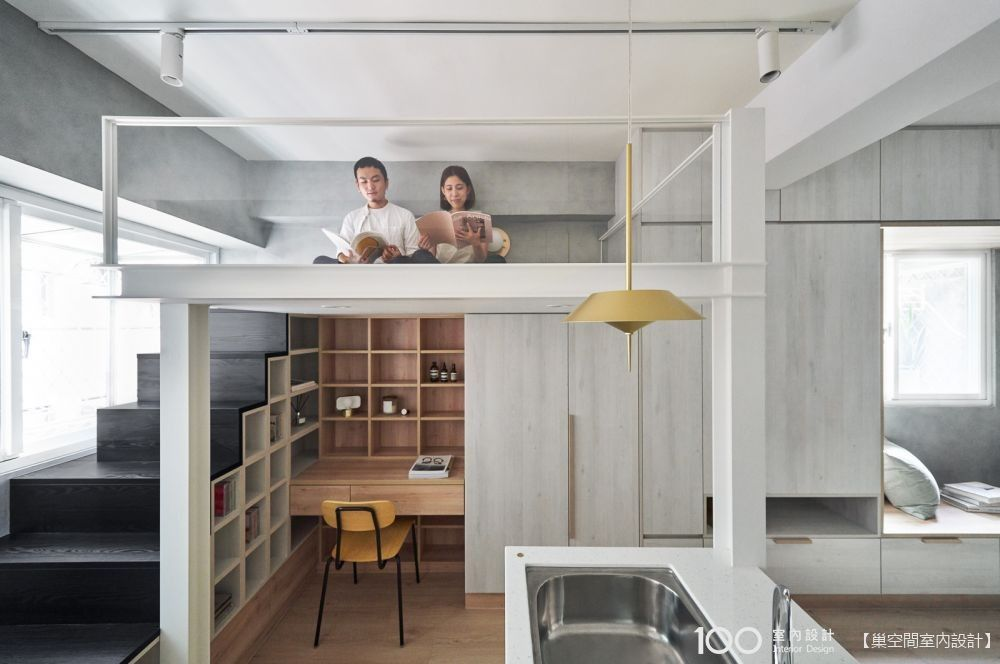

# C 房 · 次臥房
{: .no_toc }

  
目次

- TOC
{:toc}

**相關牆面**：[CN](../walls/CN) · [CE](../walls/CE) · [CS](../walls/CS) · [CW](../walls/CW)

## 概況

| 項目 | 內容 |
|---|---|
| 面積 | — 坪 / — m² |
| 淨高 | — m |
| 主要用途 | 次臥 / 書房（loft bed + 下層工作區）|

## 風格方向

**架高夾層小空間** — **上層為儲藏空間**（置物），**下層為起居**：[KL Board 壁掛翻轉床](../references/products/#kl-board--壁掛翻轉床--書桌murphy-bed) 裝在 [CW 牆](../walls/CW/)（平時收起為書桌，翻下即床）。木色為主 + 白色框架 + 水泥質感。架高結構在 [估價十、架高工程](../contract/estimate/#十架高工程) — NT$56,000。

### 參考圖（氛圍）

{: .hover-lightbox-trigger width="700" }

*圖片來源：100室內設計 / 巢空間室內設計*（**注意：此參考圖是「上睡下書桌」，本案反過來：上儲藏、下床+書桌**；只參考色調與材質氛圍，不參考功能分配）

### 喜歡的細節

- **格狀方格書櫃 / 層板**：兼展示與收納，視覺輕量
- **深色踏階 + 白色夾層框**：對比明確，踏階可兼作鞋櫃 / 抽屜
- **木色 + 白 + 灰**：素雅耐看的三色調
- **金色吊燈**：點綴色溫、避免全冷

## 地坪

- 材質：
- 色號 / 型號：
- 工法：

## 天花

- 高度：
- 造型：
- 燈槽 / 間接燈：

## 燈光配置

| 位置 | 類型 | 色溫 | 控制 |
|---|---|---|---|
| 主燈 | — | — | — |

## 空調 / 新風

- 型號：
- 位置：
- 管線走法：

## 五金 / 門

- 門扇：
- 把手 / 鉸鍊：

## 共用更衣區

- [ ] **B / C 共用更衣區** — 位於 [AS↔DN 滑軌拉門](../walls/DN/#as--dn-滑軌拉門d-側整面穿衣鏡--bc-共用更衣區) 的 D 側（內側整面穿衣鏡）
- [ ] 走廊 (alley) 空間需預留更衣動線
- [ ] 補光已在滑軌門設計項內

## 整體照片 / 靈感圖

<!--  -->

## 會議紀錄

- **YYYY-MM-DD** —
