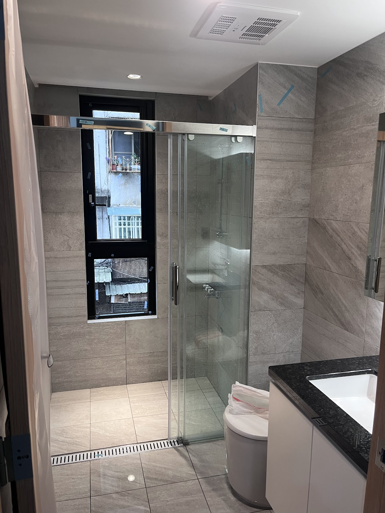

# D 房 · 衛浴
{: .no_toc }

  
目次

- TOC
{:toc}

**相關牆面**：[DN](../walls/DN.md) · [DE](../walls/DE.md) · [DS](../walls/DS.md) · [DW](../walls/DW.md)

## 概況

| 項目 | 內容 |
|---|---|
| 面積 | — 坪 / — m² |
| 淨高 | — m |
| 主要用途 | — |

## 風格方向

(填入這個房間的整體氛圍目標)

## 地坪

- 材質：
- 色號 / 型號：
- 工法：

## 天花

- 高度：
- 造型：
- 燈槽 / 間接燈：

## 燈光配置

| 位置 | 類型 | 色溫 | 控制 |
|---|---|---|---|
| 主燈 | — | — | — |

## 空調 / 新風

- 型號：
- 位置：
- 管線走法：

## 五金 / 門

- 門扇：
- 把手 / 鉸鍊：

## 共用更衣區（B / C 共用）

更衣區**不在 B 也不在 C 房內**，而是位於 **D 衛浴門外的 alley 小空間**（D 與 [A 客廳](A.md) 之間的通道），B 與 C 使用衛浴 / 更衣時都會經過此處，因此**歸入 D 的規劃**統一管理，避免 B / C 頁資訊重複。

- [ ] **位置**：D 門外的 alley 走廊（北側通向 A 客廳，東側通往 B，西側通往 C）
- [ ] **鏡面 + 補光**：整面穿衣鏡在 [AS↔DN 滑軌拉門 D 側](../walls/DN.md#as--dn-滑軌拉門d-側整面穿衣鏡--bc-共用更衣區)，鏡周邊 LED 補光（色溫 3500–4000 K）
- [ ] **動線淨空**：鏡前保留 60–80 cm 作更衣轉身空間
- [ ] **拉門收納**：面北時拉門往**左（西）**收入 [AW 冰箱縫隙](../walls/AW.md)，AS / BN 牆不動（**需實際評估冰箱空間是否可行**）
- [ ] **地坪與天花銜接**：與 A 客廳、D 衛浴的交界處（石紋磁磚 vs 衛浴防滑磚的過渡）
- [ ] **衣物暫放 / 鞋櫃**：是否於此加小型收納（隨手掛 / 脫衣籃）— 不能壓縮更衣動線
- [ ] **照明控制**：更衣區照明（進入即亮？感應？開關位置）

## 整體照片 / 靈感圖

{: .hover-lightbox-trigger width="500" }

**現況觀察**：
- **壁面**：大板**淺灰石紋磁磚**（大理石紋路），整體簡約高級感
- **地面**：同系列淺灰磁磚 + **長條形線性地排**（linear drain，在淋浴區入口地面）
- **淋浴間**：**玻璃拉門 + 固定玻璃**隔出乾濕分離，頂部橫桿為黑色金屬
- **蓮蓬頭**：垂直桿 + 花灑 + 手持蓮蓬頭
- **馬桶**：白色一體成型單體馬桶
- **洗手檯**：**黑色石材檯面** + **白色下嵌式洗臉盆** + 白色抽屜櫃體
- **鏡櫃**：右側牆面鏡面收納櫃
- **天花**：白色平頂 + 嵌入式 LED 崁燈 + **浴室暖風乾燥換氣機**（白色大面板，Panasonic / 康乃馨類）
- **窗戶**：**黑框細長直立對外窗**（可看到鄰棟建築 + 鐵窗 + 晾衣桿）→ D 也有對外牆面
- 多處藍色膠帶 X 為**驗屋標記瑕疵**，待建商修繕

**設計考量 / 待釐清**：
- [ ] 對外窗是哪一面？候選 [DN](../walls/DN.md) / [DS](../walls/DS.md) / [DE](../walls/DE.md) / [DW](../walls/DW.md) — 需對照平面圖釐清後補到該面牆頁
- [ ] 對外窗採光 vs 私密（對鄰棟、鐵窗 + 晾衣桿視覺干擾）— 是否加霧玻璃 / 百葉 / 壓花玻璃
- [ ] 淋浴間玻璃防水垢 / 防霧塗層（現場已有水痕）
- [ ] 暖風乾燥換氣機控制開關位置
- [ ] 地排長條蓋板材質與清潔維護
- [ ] 洗臉盆龍頭、毛巾架、收納五金待選
- [ ] **馬桶上方預留置物空間 — 設計留空**：不做固定吊櫃 / 木作，保留乾淨牆面；後續由軟裝處理（**現成層架 / 磁吸條 / 吸盤收納 / 壁掛籃**等可彈性增減，想變就變，不用拆裝潢）

## 會議紀錄

- **YYYY-MM-DD** —
