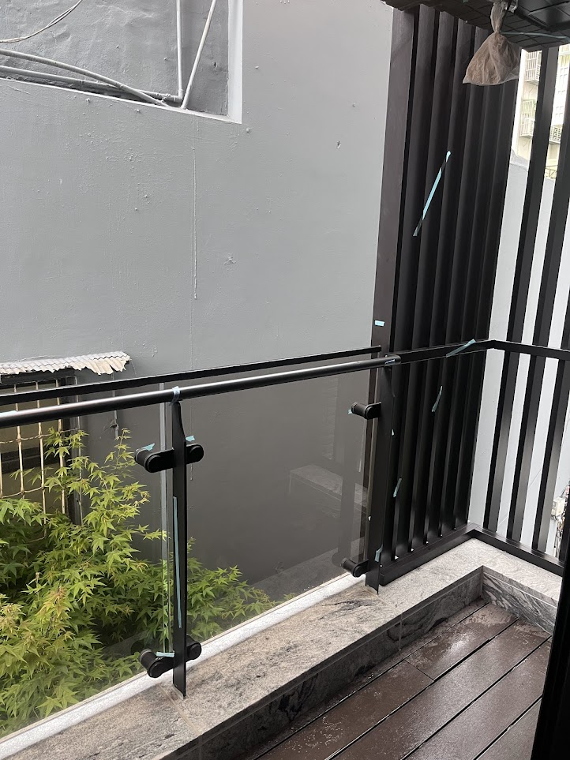

# F 房 · 陽台
{: .no_toc }

  
目次

- TOC
{:toc}

## 概況

F（陽台）位於 [A 客廳](A) 東側，原為 A 的一部分，因功能獨立性高（室外 / 洗衣 / 貓砂 / 曬衣 / 冷氣外機）故單獨成房。西牆與 [AE](../walls/AE) 為同一物理牆（見 [FW](../walls/FW)），其他三面為建築外牆。

## 設計決策

### 三層垂直堆疊配置

> 陽台狹長空間按高度分層：上層冷氣室外機、中層洗衣機、下層貓砂盆拉抽屜。

- [ ] **由上而下**：冷氣室外主機 → 洗脫烘滾筒瓦斯洗衣機 → 貓砂盆抽屜
- [ ] **洗衣機**：偏好 **惠而浦（Whirlpool）滾筒式洗脫烘** — 前開式所以上方不需要放置空間，可全部讓給冷氣室外機
- [ ] **貓砂盆做成洗衣機下方拉抽屜** — 可直接拉出清理，陽台可沖水擦乾、換新砂
  - 抽屜高度 / 淨空：需考慮貓進出是否舒適、拉出時不撞洗衣機門
  - 底盤需防水、擋砂飛濺
- [ ] **配置在哪面牆待定**，但**洗衣機需瓦斯線路 → 很可能落在 [FN](../walls/FN)**（瓦斯預留同側）— 需依建物外牆開窗、排水管位、冷氣孔位 final 確認

### 貓門

- [ ] **[FW / AE 門上開貓門](../walls/FW)** — 貓能自由進出陽台，但貓砂盆位置**不阻擋人類動線**（走道、洗衣、曬衣的路徑）
- [ ] 貓門尺寸、鎖定（夜間 / 旅行可關）

### 雨水防潑 + 通風 + 採光

- [ ] **貓砂盆區需擋外部雨水但保持通風**（百葉 / 半開 / 雨遮 / 透明防雨板）
- [ ] 陽台採光不能因堆疊配置而被完全遮擋
- [ ] 洗衣機 / 冷氣主機也需避免長時間淋雨（需雨遮或上方遮板）

### 排水 + 給水

- [ ] 陽台排水點位置（洗貓砂盆、洗衣機排水、清潔沖水）
- [ ] 水龍頭位置（沖洗貓砂盆、打掃、植栽）
- [ ] 洗衣機給排水管與建物預留管道的對位

### 地坪

- [ ] 防滑磁磚 / 地排方向（向地排口傾斜）
- [ ] 室內（AE 門檻）與陽台的高差設計，避免雨水倒灌入客廳

## 牆面

| 方位 | 代號 | 性質 |
|---|---|---|
| 北 | [FN](../walls/FN) | 瓦斯管線 + 熱水器（候選洗衣機 / 三層配置位置） |
| 東 | [FE](../walls/FE) | 玻璃欄杆 + 直立式隱形鐵窗（貓透氣） |
| 南 | [FS](../walls/FS) | 建築外牆 |
| 西 | [FW](../walls/FW) | 與 [AE](../walls/AE) 共用 — 貓門開口 |

## 現場照片

{: .hover-lightbox-trigger width="500" }

**現況觀察**：
- **護欄**：玻璃面板 + 黑色金屬扶手 / 立柱（現代簡約）— 保護膜上的藍色 X 為驗屋標記瑕疵，待建商處理
- **地坪**：分兩段 — 內側為**灰色石紋磁磚**（與客廳 AE 區延續）、外側為**木紋板材**（南方松 / 戶外複合地板）
- **外牆**：建物背面淺灰塗裝（北向建物壁面）
- **右側黑色垂直格柵**：可能為空調外機遮罩預留位或隔間百葉（與 [三層配置](#三層垂直堆疊配置) 的冷氣主機位待核對）
- **採光**：兩側開放、視野含鄰棟與綠植（有紅葉小樹入畫）
- **排水**：地面積水顯示**已有排水坡向**（需確認地排口位置與尺寸）

**設計考量**：
- [ ] 玻璃欄杆高度與貓安全（貓不會跳出、不會卡在欄杆縫）
- [ ] 石紋磁磚 / 木地板交界處的高低差、排水能否順暢過渡
- [ ] 右側黑色格柵空間是否足以容納 500L 冰箱等級的冷氣室外機（若不夠需改設其他牆面）
- [ ] 驗屋藍色 X 標記（玻璃欄杆面板）列入建商修繕清單

## 會議紀錄

- **YYYY-MM-DD** — 
