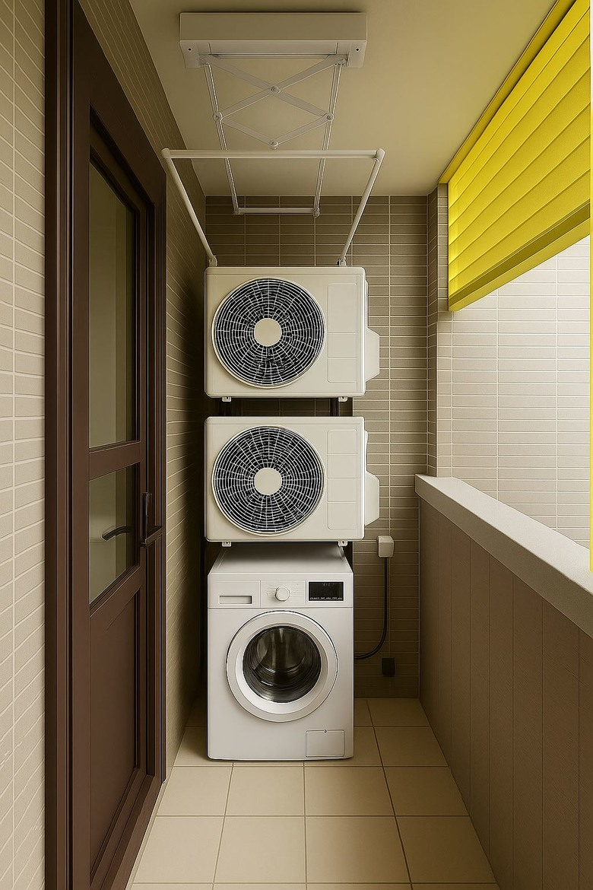
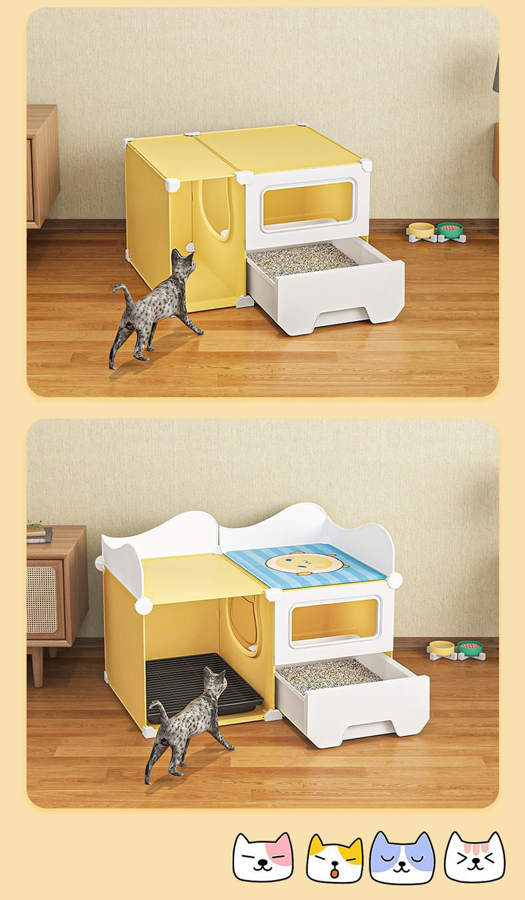
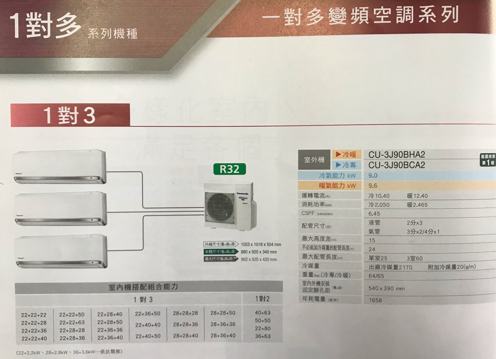

# F 房 · 陽台
{: .no_toc }

  
目次

- TOC
{:toc}

## 概況

F（陽台）位於 [A 客廳](A.md) 東側，原為 A 的一部分，因功能獨立性高（室外 / 洗衣 / 貓砂 / 曬衣 / 冷氣外機）故單獨成房。西牆與 [AE](../walls/AE.md) 為同一物理牆（見 [FW](../walls/FW.md)），其他三面為建築外牆。

## 設計決策

### 三層垂直堆疊配置

> 陽台狹長空間按高度分層：**上層冷氣室外機 / 中層洗脫烘 / 下層貓砂盆抽屜**。

{: .hover-lightbox-trigger width="400" }

*參考圖顯示上兩層均為冷氣主機 + 下層洗衣機；**本案的配置**：上層冷氣主機 × 1、**中層換成洗脫烘**、**最下方加貓砂盆預留**。*

- [ ] **由上而下**：冷氣室外主機 → 洗脫烘滾筒瓦斯洗衣機 → 貓砂盆抽屜
- [ ] **洗衣機**：偏好 **惠而浦（Whirlpool）滾筒式洗脫烘** — 前開式所以上方不需要放置空間，可全部讓給冷氣室外機
- [ ] **貓砂盆做成洗衣機下方拉抽屜** — 可直接拉出清理，陽台可沖水擦乾、換新砂
  - 抽屜高度 / 淨空：需考慮貓進出是否舒適、拉出時不撞洗衣機門
  - 底盤需防水、擋砂飛濺
  - 參考商品：[momo 貓砂抽屜櫃（雙層 / 側開貓室 + 拉出砂盤）](https://www.momoshop.com.tw/TP/TP0005149/goodsDetail/TP00051490000533) — 示意結構，客製時放大比例、配色改為與 F 陽台風格一致（黑 / 金屬 / 低調色）

{: .hover-lightbox-trigger width="400" }

*參考結構：封閉貓室 + 門簾 / 窗口 + **可拉出砂盤**。本案作法是把這個邏輯整合進陽台下層（洗衣機底座下的抽屜槽）。*
- [ ] **配置在哪面牆待定**，但**洗衣機需瓦斯線路 → 很可能落在 [FN](../walls/FN.md)**（瓦斯預留同側）— 需依建物外牆開窗、排水管位、冷氣孔位 final 確認

### 空調系統（一對三，室外機在 F）

全家冷氣採 **一台室外主機 + 三台室內機（one-to-three）** 配置，室外主機放在 F 陽台上層（見 [三層配置](#三層垂直堆疊配置)），室內機分別供應 [A 客廳](A.md)、[B 主臥](B.md)、[C 次臥](C.md)。

- [ ] **品牌尚未定案** — 候選（待比較）：日立 / 大金 / Panasonic / 三菱重工 / LG
- [ ] **架構**：1 outdoor × 3 indoor（multi-split / VRF mini-multi）
- [ ] **噸數下修理由**：
  - 實務上三間不會同時開冷氣
  - **設計容量對應「最多 2 間同開」為上限即可**
  - 極端情況三間同開時效果略差可接受（不必過度設計）
- [ ] 室內機位置：
  - **A 客廳**：無既有冷氣室內機（AE/AS 轉角為**新風系統**，非冷氣），位置待定 — 候選 AS / AN 天花或 AE 接近 F 側
  - **B 主臥**：位置待定（[BN](../walls/BN.md) / [BS](../walls/BS.md) / [BE](../walls/BE.md) 擇一，避開 [BE 的 LD002 翻轉床](../walls/BE.md)）
  - **C 次臥**：位置待定（需避開 [CW 的 KL Board 翻轉床](../walls/CW.md) + [架高夾層](C.md) 上方儲藏）
- [ ] 冷媒管、排水管從 F 室外機走到三房的天花板路徑（需預留包樑 / 管槽）
- [ ] 電源專用迴路（室外機一般 220V）
- [ ] 靜音與震動（室外機在陽台，與主臥 BS/BN 距離近，需確認 noise level）

#### 候選機種：Panasonic CU-3J90 系列 (1 對 3)

{: .hover-lightbox-trigger width="600" }

| 項目 | 內容 |
|---|---|
| 型號 | **CU-3J90BHA2**（冷暖）/ **CU-3J90BCA2**（冷專） |
| 冷媒 | R32，能源效率第 1 級 |
| 冷氣能力 | **9.0 kW** · 暖氣 9.6 kW |
| CSPF | 6.45，年耗電量 1,658 度 |
| 本體尺寸 (寬×高×深) | **880 × 920 × 340 mm**（最大 962 × 920 × 420） |
| 外箱尺寸 | 1053 × 1018 × 504 mm |
| 重量 | 64 kg（冷專）/ 65 kg（冷暖） |
| 固定腳孔距 | 540 × 390 mm |
| 最大配管長度 | 單室 25 m / 3 室合計 60 m |
| 最大高度差 | 15 m |
| 免補冷媒 | 24 m 以內 |
| 室內機搭配 (共 20 組合) | 22+22+22 ~ 28+36+40 等（22=2.2 kW / 28=2.8 kW / 36=3.6 kW / 40=4.0 kW / 50=5.0 kW） |

**本案初步配置建議**（9.0 kW 總 outdoor、**以 2 間同開為上限**設計）：

| 房間 | 坪數推估 | 建議冷氣能力 | 候選室內機型 |
|---|---|---|---|
| [A 客廳 + 廚房](A.md) | 8–10 坪 | 3.6–4.0 kW | 36 或 40 |
| [B 主臥](B.md) | 3–4 坪 | 2.2–2.8 kW | 22 或 28 |
| [C 次臥](C.md) | 3–4 坪 | 2.2–2.8 kW | 22 或 28 |

- 例：**36 + 28 + 22** 或 **40 + 22 + 22** — 合計 8.6–8.4 kW 略低於 outdoor 9.0 kW，任 2 間同開都能吃滿冷房能力
- 三間同開時受限於 outdoor 總能力，可能略不夠冷 → 符合使用者接受範圍

**待確認**：
- [ ] 是否選 Panasonic 此機種 或比較日立 / 大金 / 三菱重工 等同級 1 對 3
- [ ] 冷暖 vs 冷專（暖氣成本多約 NT$？）
- [ ] 本體 880 × 920 × 340 mm + 重 65 kg → 確認 [三層配置](#三層垂直堆疊配置) 上層支撐與空間夠
- [ ] 冷媒配管總長度估算（F → A 客廳 + F → B 主臥 + F → C 次臥）需 < 60 m
- [ ] 固定腳孔距 540 × 390 mm → 與陽台結構 / 三層底座相容

### 貓門

- [ ] **[FW / AE 門上開貓門](../walls/FW.md)** — 貓能自由進出陽台，但貓砂盆位置**不阻擋人類動線**（走道、洗衣、曬衣的路徑）
- [ ] 貓門尺寸、鎖定（夜間 / 旅行可關）

### 雨水防潑 + 通風 + 採光

- [ ] **貓砂盆區需擋外部雨水但保持通風**（百葉 / 半開 / 雨遮 / 透明防雨板）
- [ ] 陽台採光不能因堆疊配置而被完全遮擋
- [ ] 洗衣機 / 冷氣主機也需避免長時間淋雨（需雨遮或上方遮板）

### 排水 + 給水

- [ ] 陽台排水點位置（洗貓砂盆、洗衣機排水、清潔沖水）
- [ ] 水龍頭位置（沖洗貓砂盆、打掃、植栽）
- [ ] 洗衣機給排水管與建物預留管道的對位

### 地坪

- [ ] 防滑磁磚 / 地排方向（向地排口傾斜）
- [ ] 室內（AE 門檻）與陽台的高差設計，避免雨水倒灌入客廳

## 牆面

| 方位 | 代號 | 性質 |
|---|---|---|
| 北 | [FN](../walls/FN.md) | 瓦斯管線 + 熱水器（候選洗衣機 / 三層配置位置） |
| 東 | [FE](../walls/FE.md) | 玻璃欄杆 + 直立式隱形鐵窗（貓透氣） |
| 南 | [FS](../walls/FS.md) | 建築外牆 |
| 西 | [FW](../walls/FW.md) | 與 [AE](../walls/AE.md) 共用 — 貓門開口 |

## 現場照片

{: .hover-lightbox-trigger width="500" }

**現況觀察**：
- **護欄**：玻璃面板 + 黑色金屬扶手 / 立柱（現代簡約）— 保護膜上的藍色 X 為驗屋標記瑕疵，待建商處理
- **地坪**：分兩段 — 內側為**灰色石紋磁磚**（與客廳 AE 區延續）、外側為**木紋板材**（南方松 / 戶外複合地板）
- **外牆**：建物背面淺灰塗裝（北向建物壁面）
- **右側黑色垂直格柵**：可能為空調外機遮罩預留位或隔間百葉（與 [三層配置](#三層垂直堆疊配置) 的冷氣主機位待核對）
- **採光**：兩側開放、視野含鄰棟與綠植（有紅葉小樹入畫）
- **排水**：地面積水顯示**已有排水坡向**（需確認地排口位置與尺寸）

**設計考量**：
- [ ] 玻璃欄杆高度與貓安全（貓不會跳出、不會卡在欄杆縫）
- [ ] 石紋磁磚 / 木地板交界處的高低差、排水能否順暢過渡
- [ ] 右側黑色格柵空間是否足以容納 500L 冰箱等級的冷氣室外機（若不夠需改設其他牆面）
- [ ] 驗屋藍色 X 標記（玻璃欄杆面板）列入建商修繕清單

## 會議紀錄

- **YYYY-MM-DD** — 
