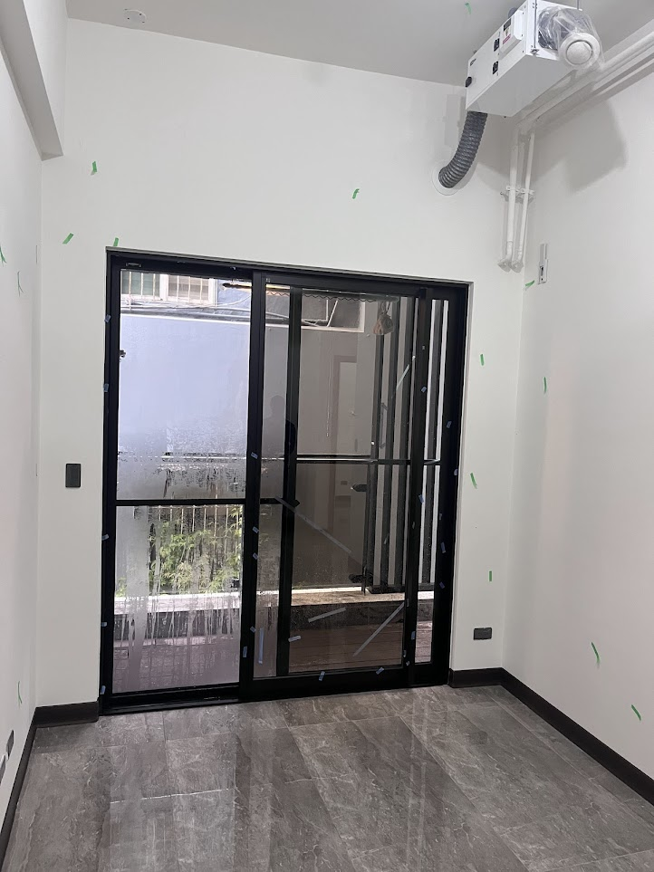
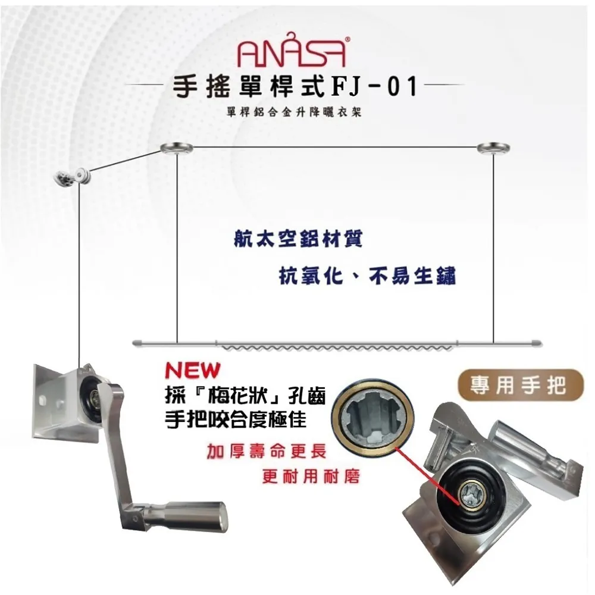

# AE — A房 東牆（客廳→F陽台）
{: .no_toc }

  
目次

- TOC
{:toc}

## 基本資訊

| 項目 | 內容 |
|---|---|
| 尺寸 (寬 × 高) | — m × — m |
| 材質 | 黑框落地推拉 / 摺疊門 + 紗網 |
| 相鄰空間 | 東側 = [F 陽台](../rooms/F/) |
| 合約圖號 | — |

本頁聚焦 **客廳側**。陽台側（貓門、三層配置、排水、雨遮等）見 [F 房](../rooms/F/) 與 [FW](FW)。

## 設計決策

### 黑框落地推拉 / 摺疊門

- 現況：**黑框 4 片格子推拉 / 摺疊門** + 紗網，通往 [F 陽台](../rooms/F)
- [ ] 門扇與 [客廳 AN 書牆](AN) 轉角收邊
- [ ] 門軌道與天花板高度協調（不壓迫）
- [ ] 貓門開口整合（見 [FW](FW)）

### AE 天花板（客廳側）

- [ ] 天花板已安裝**分離式冷氣室內機** — 冷媒管 / 排水管 / 可撓管封板方式
- [ ] 出風方向是否干擾 [AS 懸吊訓練牆](AS)
- [ ] [手搖升降曬衣桿 ANASA FJ-01](#ae-天花手搖升降曬衣桿隱藏式) — 雨天室內曬棉被 / 當日衣物，藏於 AE 側天花
- [ ] 與天花冷氣管線不互相干涉

## 插座 / 開關

| 位置 (距地 / 距牆) | 類型 | 用途 | 狀態 |
|---|---|---|---|
| — | — | — | — |

## 燈具

- 主燈：
- 輔助：
- 開關位置：

## 櫃體 / 固定家具

- 尺寸：
- 材質 / 飾面：
- 五金：
- 內部配置：

## 現場照片

{: .hover-lightbox-trigger width="500" }

{: .hover-lightbox-trigger width="500" }

**AE 客廳側觀察**：
- 黑框落地推拉 / 摺疊門通往 F 陽台（4 片格子分割）
- 門框為黑色金屬，含紗網
- 天花板已安裝**分離式冷氣室內機**（白色）+ 冷媒管 / 排水管 / 可撓管
- AE 兩側白牆上有**插座 + 面板**（左下、右下）
- 地板為深灰石紋磁磚、踢腳線深色

## 參考產品 / 圖片

### AE 天花：手搖升降曬衣桿（隱藏式）

{: .hover-lightbox-trigger width="500" }

**參考商品**：ANASA 手搖單桿式 FJ-01（PChome：[DQBX37-A900JGY09](https://24h.pchome.com.tw/prod/DQBX37-A900JGY09?fq=/S/DQBX37)）

**用途**：
- 雨天 / 不適合戶外的日子在室內曬棉被、床單、衣物
- 外出回家的 **污衣暫放區**（掛外套 / 當天穿過但不需立刻洗的衣物）
- 平時不用時往天花收起

**設計需求**：
- [ ] 位置：AE 側天花板，靠近陽台推拉門（方便從外面拿進衣物）
- [ ] **隱藏式**收納：天花板做凹槽 / 藏板 / 蓋板，桿子升到頂時完全不露、視覺乾淨
- [ ] 桿子下降時淨空：下方不能有固定家具擋住
- [ ] 手搖把手位置：選靠牆、伸手好搖的點（另評估是否改電動以便老人 / 省力）
- [ ] 與 [A 房天花雙吊點](../rooms/A/#中央雙吊點多用途懸吊) 位置不互相干涉
- [ ] 與 [投影布幕 AW 側](../rooms/A/#投影布幕aw-側天花預留) 不在同一條軌道

## 會議紀錄

- **YYYY-MM-DD** — 
