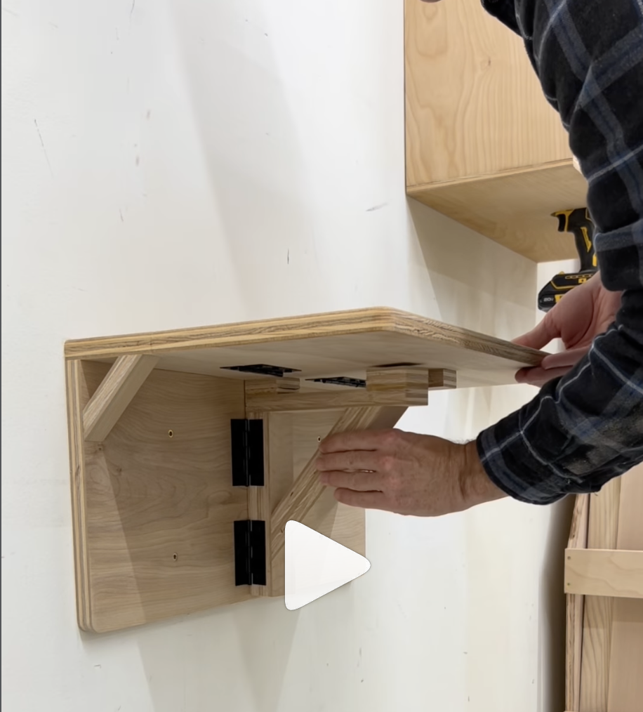
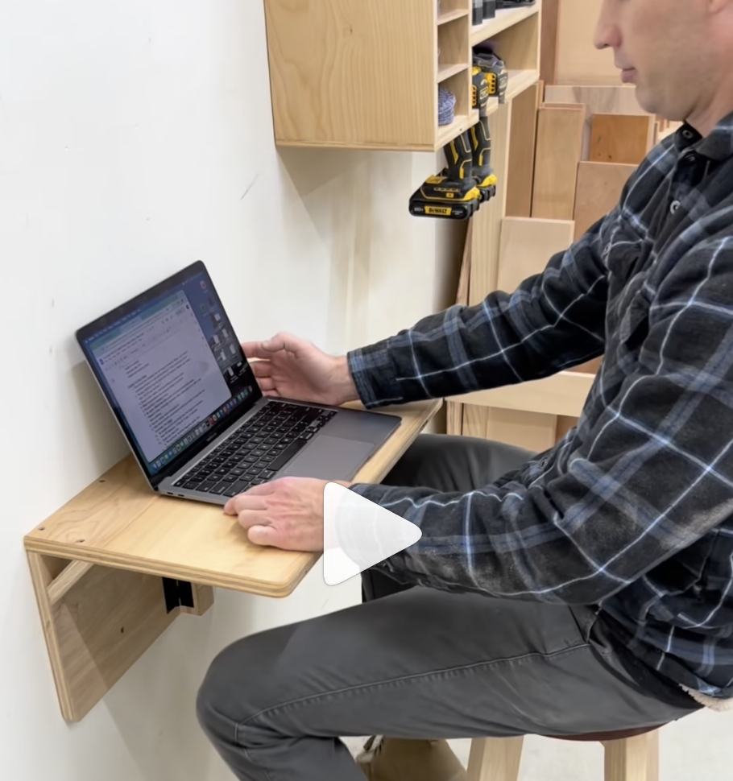
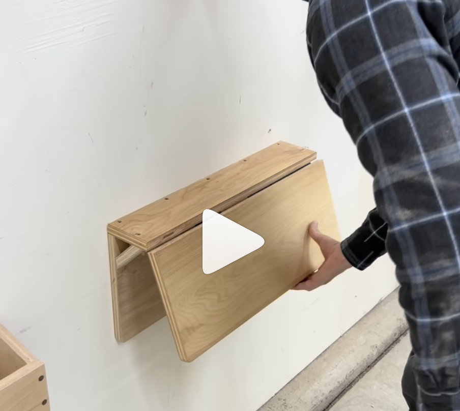
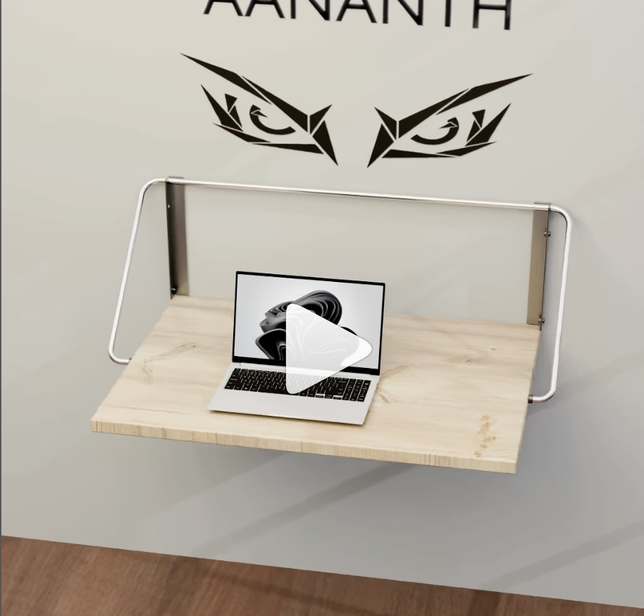
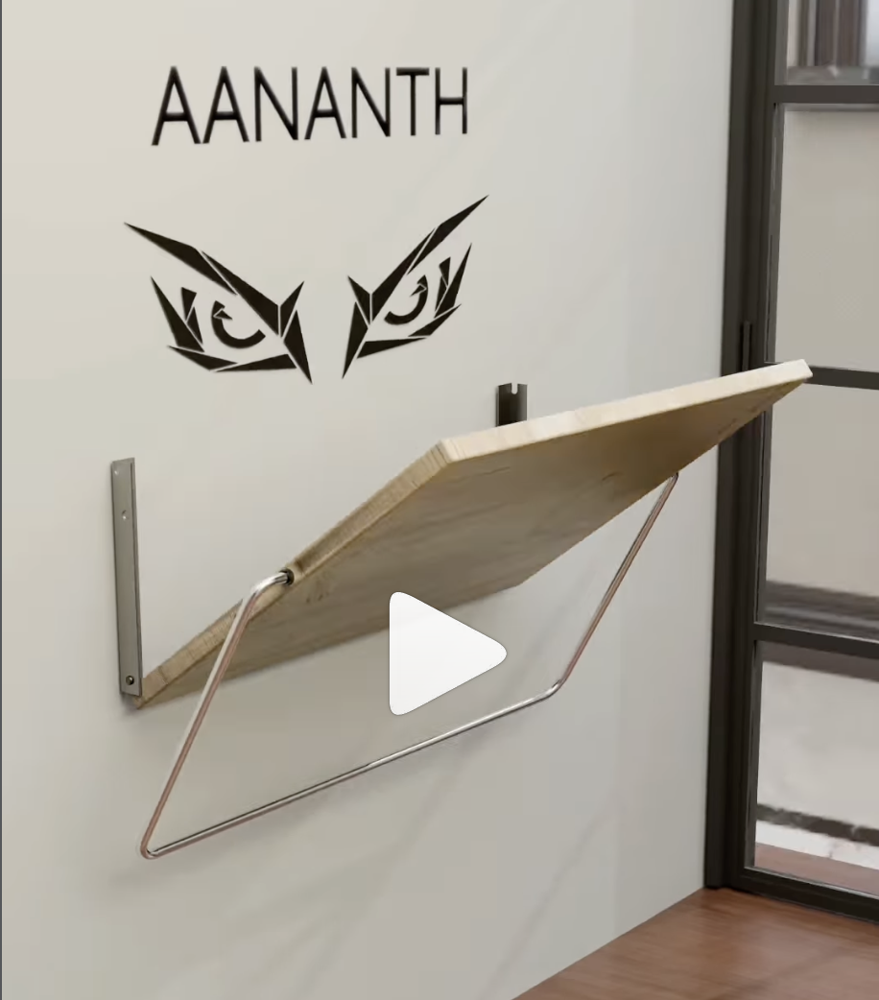
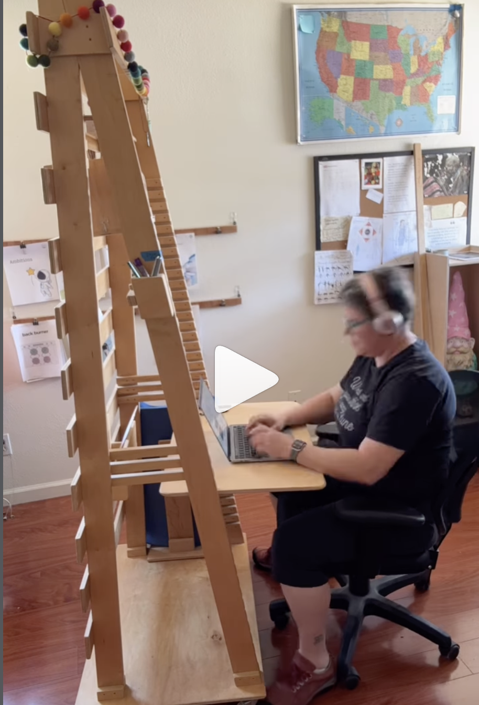
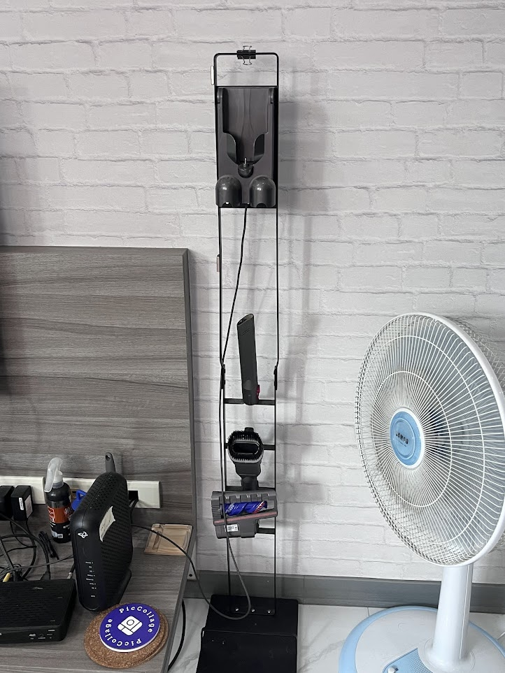
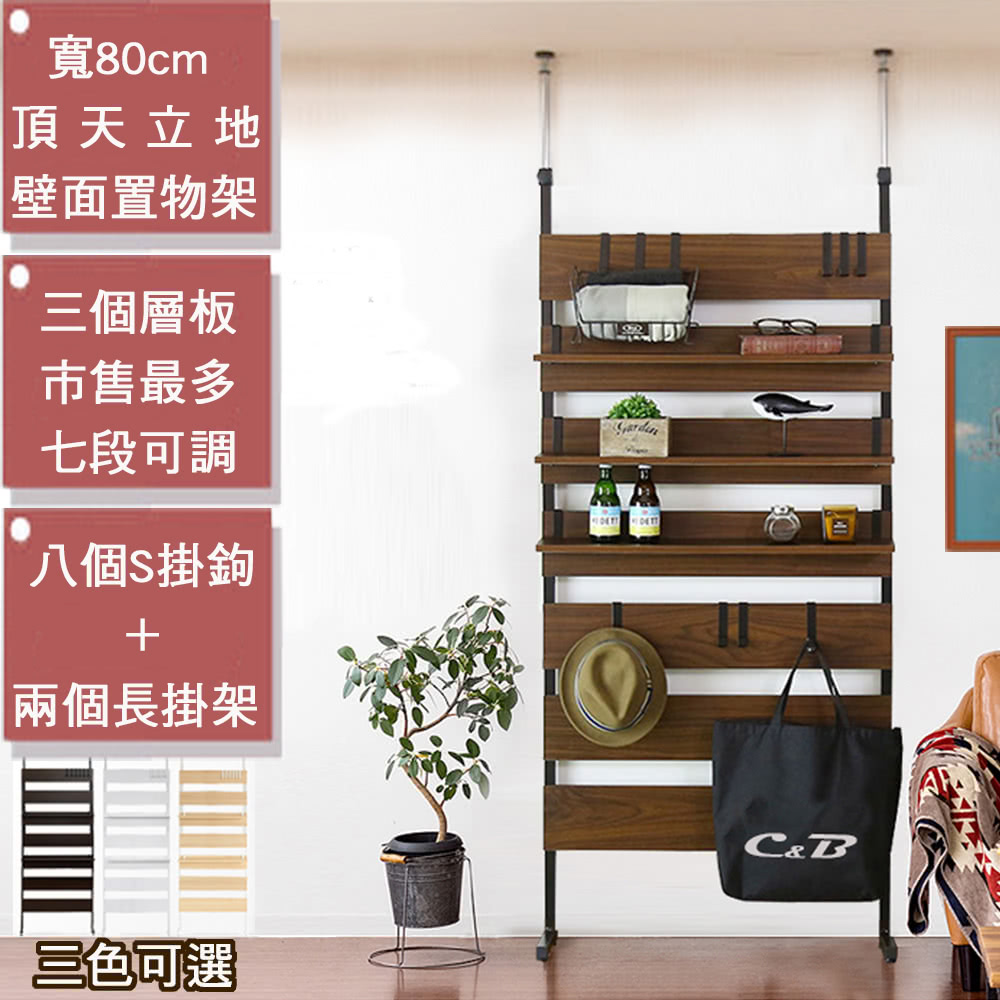

# AN — A房 北牆（客廳/廚房）
{: .no_toc }

  
目次

- TOC
{:toc}

## 基本資訊

| 項目 | 內容 |
|---|---|
| 尺寸 (寬 × 高) | — m × — m |
| 材質 | — |
| 相鄰空間 | — |
| 合約圖號 | — |

## 設計決策

> **全家的核心重點牆** — 一整面客廳大書牆 + 工作站，從 AW 轉角到 AE 轉角的 AN 整面使用同一套卡扣系統。
>
> **AN 頂部做到真實天花板** — 爭取最大垂直利用空間。裝飾天花板在 **AN 與 AE 側做退縮**（天花邊緣不壓 AN 與 AE 牆體），讓兩面牆保持全高視覺。

### 分區（由西 → 東）

1. **入口左手邊（對講機側）= 玄關區**：簍空對講機區 + **上下櫃體** — 遮住管線、藏雜物，同時作為**玄關鞋櫃 + 雨傘架**
   - **下櫃**：常用**外出鞋 6–8 雙**（不常用鞋全數收 [儲藏室](../rooms/C.md#架高夾層配置上下層)）
   - **上櫃**：外出包 / 購物袋 / 雨衣 / 手套（進門順手放）
   - **下櫃側邊或櫃內角**：預留**雨傘架空間**（含滴水盤 / 導水，避免濕雨傘弄濕櫃體）
   - [ ] 鞋櫃通風（底部懸空 + 通風孔避免悶臭）
   - [ ] 雨傘架尺寸：容納長傘 3–4 支 + 短折傘 2–3 支
2. **對講機右 → AE 轉角**：**整面直立條狀卡扣系統**（類似 String / Vitsœ 606 / French cleat 牆）
   - 橫向淺木色書板自由卡接
   - 高度、水平位置皆可調節
   - 其中一塊 **特別長的板作為站立辦公桌** 使用
3. **電箱段**：外觀為書架的一部分，但內部為**可快速開啟**的機關
   - 候選機制：**轉開式**（側邊鉸鍊、整段書架向外轉出）或 **滑開式**（書架沿軌道側移）
   - 關上時外觀與其他書架無異
4. **底色處理**：整面使用**背板（壁紙或油漆）**打底，避免卡扣系統與書物呈現凌亂感，同時**包覆隱藏電箱**
   - 方向一：**深色森林風壁紙** — 深綠 / 深藍底，帶動物插畫（狐狸、鹿、鳥、昆蟲），書板淺木色在上形成樹林層次感
   - 方向二：**純深色耐看** — 均勻深墨綠 / 深灰 / 深藍漆，極簡背景讓書本與擺飾成為主角
   - [ ] 與 [AS 懸吊訓練牆](AS.md) 的深色飾面做色系呼應（避免 AN/AS 兩面深色牆互相衝突）
   - [ ] 壁紙 vs 油漆：壁紙圖案豐富但接縫與電箱機關處較難收邊；油漆好維修但少了細節

### 燈光

- [ ] **書板下方 LED 燈條** — 每層書板下緣裝燈條打書本，同時照亮貓咪玩耍區
- [ ] 色溫：暖白 2700–3000 K（閱讀舒適）
- [ ] 電源 / 控制走法（整面統一開關 or 分區）
- [ ] **軌道供電方案** — 因書板可自由調整位置，下方燈條無法用固定線位。候選：
  - 卡扣立柱內走**磁吸式 48V 低壓軌道**（類似 Flos Sparks、台製磁吸軌道），燈條用配套轉接頭吸上即通電
  - 立柱內走 **低壓銅排**，燈條底部有彈簧觸點任意夾點供電
  - 最簡化：書板背面黏型電池式 LED + 無線遙控（維護較麻煩）
- [ ] 電源驅動器（變壓器）藏在頂部走線槽 / 電箱段內

### 電腦工作站

- [ ] **螢幕支架手臂固定在卡扣槽中** — 隨書板高度調整
- [ ] **站立辦公桌高度約 95–110 cm**（依使用者身高微調）
- [ ] 鍵盤 / 滑鼠的收納位（站立 vs 座位切換）
- [ ] 桌面下方走線槽（螢幕電源、HDMI、USB hub）

#### 可上掀固定式站立桌面（**180° 反折收納**）

**概念**：AN 書牆上規劃**幾塊可上掀固定的書架板**，需要工作時打開成為站立桌面（放筆電），不用時收起。與螢幕支架手臂配合使用。

**參考機構**（需修改收納方向）：

{: .hover-lightbox-trigger width="350" }
{: .hover-lightbox-trigger width="350" }
{: .hover-lightbox-trigger width="350" }

**本案差異（收納方向修改）**：

- ❌ **不要**上面第三張參考圖的**下垂收法**（桌板從鉸鍊往下懸吊掛在牆面）— 會破壞 AN 書牆的平整視覺
- ✅ **改為 180° 反折向上**：桌板收起時**翻到自身支撐結構背面**（貼平上方書板），整體**變厚一點但視覺上仍是一塊平書板**，從前方看不出這是折疊桌
- 達成這個效果的作法候選：
  - **雙向鉸鍊 / 180° 翻折鉸鍊**（類似筆電螢幕轉軸，可向下翻成桌面，也可向上翻 180° 收平）
  - 支撐腳 / 支撐架設計成**可折疊到桌板底下**（展開自動彈出、收起自動收攏）
  - 固定扣 / 磁吸定位（收納時穩定不會誤開）
- [ ] **桌板尺寸**：適合放 13–16 吋筆電 + 手邊滑鼠空間（約 W 60 × D 35 cm）
- [ ] **承重**：筆電 + 手臂壓力（建議 ≥ 15 kg）
- [ ] **高度**：卡扣系統中放到站立工作高度（95–110 cm）
- [ ] **數量**：**幾塊**（2–3 塊？）可分佈在 AN 不同位置，讓使用者可選坐立不同姿勢
- [ ] 與 [螢幕支架手臂](#電腦工作站) 位置協調，確保桌板展開後螢幕在合適距離

**替代機構參考 — 金屬線支撐式折疊桌**（高度需可調配合卡扣槽）：

{: .hover-lightbox-trigger width="350" }
{: .hover-lightbox-trigger width="350" }

- **機構**：木桌板 + 上下牆面托架 + **兩側金屬線**做張力支撐（展開時金屬線拉直、收起時金屬線鬆回）
- **優點**：視覺最小化、金屬線與卡扣立柱風格相容、桌板本身薄平
- **本案修改**：原設計牆面托架是**固定鎖位**，本案要**能卡在 AN 立柱卡扣槽裡**，讓整組桌面**隨書板一起高度可調**
  - 即：上托架 + 下托架都是卡扣規格（插入任一水平位置）
  - 金屬線長度要與托架上下距離匹配（或做**可調長金屬線** / 可拆式）
- **比較**：與上方 180° 反折式相比
  - 反折式收起看起來是整塊平板（視覺乾淨）
  - 金屬線式收起後桌板會垂下（視覺有存在感）
  - ⚠️ **用戶偏好：180° 反折收納** — 金屬線式僅作備案參考

**第三種機構參考 — 橫向溝槽插拔**（最單純）：

{: .hover-lightbox-trigger width="400" }

- **機構**：立柱上做**橫向連續溝槽**，桌板**直接從側邊插入** — 不用鉸鍊、不用金屬線、零活動件
  - 拉出 = 工作桌面
  - 推回 = 桌板滑進立柱槽內，平時完全隱藏在牆內 / 立柱間
- **本案適配性**：
  - ✅ **與 AN 卡扣立柱系統邏輯天然契合** — 立柱原本就會有連續孔 / 槽 → 把其中幾層改做「深孔槽」容納桌板
  - ✅ **高度天然可調** — 哪個溝槽都能插
  - ✅ **零機構最簡單、最穩** — 沒有鉸鍊磨損、沒有金屬線鬆弛問題
  - ✅ **收納最乾淨** — 平時根本看不到桌板（推進去後只露出側邊斷面）
- **需考慮**：
  - [ ] 溝槽深度 ≥ 桌板深度（若桌板深 35 cm，槽也要深 35 cm 才能完全收進）— 這會**加深整個 AN 書牆的深度**
  - [ ] 桌板承重：純靠左右卡槽支撐，承重取決於槽口強度與桌板硬度，**可能需要加寬卡槽或在立柱內加金屬襯套**
  - [ ] 桌板會不會自己滑出 — 需要**卡點 / 磁吸 / 小掣子**做定位
  - [ ] 不用時桌板邊緣與立柱切齊的視覺收邊

**三方案比較總結**：

| 方案 | 收納視覺 | 機構複雜度 | 高度可調 | AN 系統相容 |
|---|---|---|---|---|
| 180° 反折 | ⭐⭐⭐（平板，看不出） | 中（鉸鍊 + 支撐腳） | 中（隨卡扣） | 中 |
| 金屬線支撐 | ⭐（下垂明顯） | 低 | 需客製托架 | 低 |
| **橫向溝槽插拔** | ⭐⭐⭐（完全藏入） | **最低**（零活動件） | ⭐⭐⭐（任何槽） | ⭐⭐⭐ |

- ⚠️ **橫向溝槽方案需要加深 AN 書牆深度**（相當於桌板深度），需與設計師評估是否可接受

### 多功能

- 書籍收納
- 展示 / 擺飾
- 貓咪攀爬 + 玩耍（書板可兼作跳台）
- 站立工作桌
- 螢幕 + 監視器 / 電腦工作站

### 工程需求

- [ ] 牆面打底 + 卡扣立柱與 RC 牆的固定點（垂直鑽孔 / 膨脹螺絲）
- [ ] 背板（壁紙 or 噴漆）先於卡扣系統施工
- [ ] 電箱段的鉸鍊 / 滑軌承重與開啟淨空（不擋動線）
- [ ] 每層書板最大載重（放書需承 15–30 kg/m）
- [ ] LED 燈條電源、驅動位置（建議藏在卡扣立柱內或頂部走線槽）
- [ ] 螢幕手臂支架與卡扣系統的**相容轉接件**（可能需客製化 bracket）

### Dyson 吸塵器充電支架（既有，釘上牆）

{: .hover-lightbox-trigger width="300" }

現有 Dyson 立式吸塵器 + 充電支架（非新購），需規劃**釘上 AN 牆**。

- [ ] **位置**：**AN 靠近 AE 角落**（不起眼但好拿取）— 避開書牆核心展示區
- [ ] **電源**：該點位需預留**牆面插座**（支架下方或側邊），供充電線穿出
- [ ] 支架背板與 AN 卡扣立柱 / 背景漆的搭配（支架為黑色，與深色背板協調）
- [ ] 釘點避開卡扣立柱軌道，或改鎖在立柱內（視支架底座尺寸）
- [ ] 高度：吸塵器整支高度約 120–130 cm，支架頂端距地約 140–150 cm（方便從上取下）

## 插座 / 開關

| 位置 (距地 / 距牆) | 類型 | 用途 | 狀態 |
|---|---|---|---|
| — | — | — | — |

## 燈具

- 主燈：
- 輔助：
- 開關位置：

## 櫃體 / 固定家具

- 尺寸：
- 材質 / 飾面：
- 五金：
- 內部配置：

## 現場照片

{: .hover-lightbox-trigger width="700" }

**觀察**：
- AN 牆已安裝電箱（淺米色嵌入櫃）+ 對講機/門鈴面板
- 地板插座區集中在電箱下方、踢腳線附近
- 天花板為水泥裸頂 + 風管 / 管線外露 → 會安裝簡易天花板
- 角落踢腳線已安裝深色收邊

## 參考產品 / 圖片

### 頂天立地壁面置物架（現成商品參考）

{: .hover-lightbox-trigger width="400" }

**參考商品**：[momo 寬 80 cm 頂天立地壁面置物架](https://m.momoshop.com.tw/goods.momo?i_code=7792880)（深木色 / 黑立柱 / 3 層板 7 段可調 / 8 S 掛鉤 + 2 長掛架 / 三色可選）

- **型式**：頂天立地雙立柱 + 可調層板 + 掛鉤 — 不需鎖牆、靠天花板與地板張力固定
- **符合本案概念**：深色木板 + 黑色立柱卡扣 + 層板可調 + S 掛鉤延伸使用方式，接近 AN 牆自製卡扣系統的視覺與功能邏輯
- **可借用的設計語彙**：
  - 深木色層板 × 深色立柱的對比
  - 立柱帶連續卡扣孔，層板與掛鉤皆可任意插入
  - S 掛鉤 + 長掛架讓立柱兼作掛物（可放貓玩具、外套）
- **跟自製版本的差異**：
  - 本案 AN 為**整面牆**（寬度遠大於 80 cm）且有電箱機關 / 站立桌 / 螢幕支架 — 現成商品無法直接滿足，但可以作為層板模組化、掛鉤延伸的靈感來源
  - 自製版本可用 **French cleat 或 Vitsœ 606** 規格，在結構承重與客製細節上更靈活

### 關鍵字

- **卡扣 / 軌道書牆系統**：String Furniture、Vitsœ 606、Tylko、USM Haller、Elfa、IKEA Boaxel、French cleat wall
- **書板下 LED 燈條**：IKEA OMLOPP、Philips Hue LightStrip、Flexfire LED
- **螢幕支架相容**：Ergotron LX、Herman Miller Ollin（需確認能否鎖在卡扣立柱上）
- **電箱隱藏書架機關**：旋轉式（pivot-door bookshelf）、滑動式（sliding barn-door shelf）

## 會議紀錄

- **YYYY-MM-DD** — 
