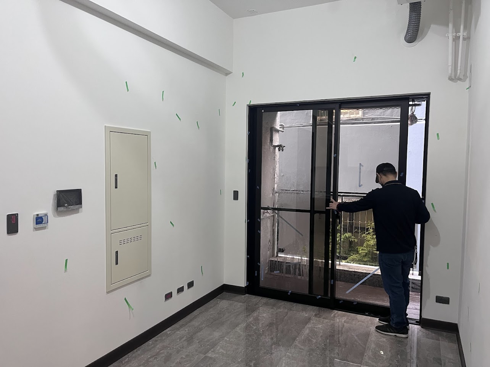

# AN — A房 北牆（客廳/廚房）
{: .no_toc }

  
目次

- TOC
{:toc}

## 基本資訊

| 項目 | 內容 |
|---|---|
| 尺寸 (寬 × 高) | — m × — m |
| 材質 | — |
| 相鄰空間 | — |
| 合約圖號 | — |

## 設計決策

- [ ] (待填)

## 插座 / 開關

| 位置 (距地 / 距牆) | 類型 | 用途 | 狀態 |
|---|---|---|---|
| — | — | — | — |

## 燈具

- 主燈：
- 輔助：
- 開關位置：

## 櫃體 / 固定家具

- 尺寸：
- 材質 / 飾面：
- 五金：
- 內部配置：

## 現場照片

{: .hover-lightbox-trigger width="700" }

**觀察**：
- AN 牆已安裝電箱（淺米色嵌入櫃）+ 對講機/門鈴面板
- 地板插座區集中在電箱下方、踢腳線附近
- 天花板為水泥裸頂 + 風管 / 管線外露 → 會安裝簡易天花板
- 角落踢腳線已安裝深色收邊

## 參考產品 / 圖片

- 

## 會議紀錄

- **YYYY-MM-DD** — 
