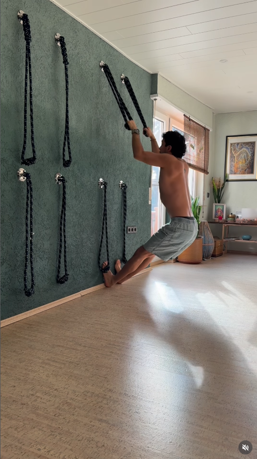

# AS — A房 南牆（客廳）
{: .no_toc }

  
目次

- TOC
{:toc}

## 基本資訊

| 項目 | 內容 |
|---|---|
| 尺寸 (寬 × 高) | — m × — m |
| 材質 | — |
| 相鄰空間 | — |
| 合約圖號 | — |

- [ ] **主牆做懸吊訓練 / 攀岩式鍊條牆** — 牆面安裝多組埋入式錨點（上排），搭配可拆卸鍊條握把，做懸吊、引體、深蹲輔助等訓練
- [ ] 壁體結構評估：需能承受動態體重負荷，RC 牆面優先；若為輕隔間需加背板或結構補強
- [ ] 錨點位置、高度、間距（上排與下排）待與設計師定案
- [ ] 牆面飾面：深色礦物塗料 / 藝術漆（參考圖的墨綠色）
- [ ] **AS ↔ DN 之間加滑軌拉門** — 公私區分隔（客廳 / 臥室衛浴側）
  - **只做上方滑軌**（吊掛式），**不做地面軌道** — 避免絆腳、保留地坪連續性
  - 門扇重量與上軌結構強度需評估
  - **拉門開啟時朝北收入冰箱縫隙（[AW](AW) 北端 / 冰箱南側）** — AS 與 BN 整片牆保持完整，不需預留拉門收納槽
  - 關閉時拉門跨越 AS↔DN 位置
  - 另見 [DN 頁](DN) — 拉門 D 側整面穿衣鏡 + 補光 (B/C 共用更衣區)

### 客廳 ↔ 主臥 通風採光窗（AS 上段）

> AS 同時是 [B 主臥](BN) 的北牆 — 客廳與主臥共享的這面牆上方靠近天花板處，開一排通風採光窗，把客廳的光與空氣引入主臥，但保持主臥隱私與休息時的光/聲隔絕。

- [ ] **位置**：AS 靠天花板頂端開一排橫向高窗（high clerestory），高度避開站立視線
- [ ] **開窗尺寸**：因 B 側衣櫃在 [BW](../walls/BW) 而非 BN，AS 上段不被衣櫃擋住，**窗孔可加大**（採光/通風更充足）
- [ ] **隱私**：避免直接視覺穿越（霧面 / 壓花玻璃 / 格柵 / 百葉 / 布幔），只傳光與風
- [ ] **貓通行阻絕**：開口小於貓頭可過的尺寸，或加金屬格柵 / 細網
- [ ] **休息時可全暗 + 靜音**：主臥側加可關閉的門板 / 厚布簾 / 吸音材，客廳光與聲不透入
- [ ] **與 AS 懸吊錨點協調**：鍊條牆 / 貓爬架錨點需**避開窗面**，所以窗應該位於整面牆的**最上緣**（錨點集中在中下段）
- [ ] 與冷氣出風、天花板分離式冷氣室內機（見 [AE](AE)）不干涉

## 插座 / 開關

| 位置 (距地 / 距牆) | 類型 | 用途 | 狀態 |
|---|---|---|---|
| — | — | — | — |

## 燈具

- 主燈：
- 輔助：
- 開關位置：

## 櫃體 / 固定家具

- 尺寸：
- 材質 / 飾面：
- 五金：
- 內部配置：

## 現場照片

<!--  -->

## 參考產品 / 圖片

### 懸吊訓練牆 (suspension training wall)

{: .hover-lightbox-trigger width="500" }

- **型式**：牆面埋入式金屬錨點（上排），鍊條 + 握把懸掛
- **動作**：懸吊引體、俯身划船、輔助深蹲、核心訓練
- **類似商品關鍵字**：wall anchor suspension trainer、climbing chain wall、indoor training wall system

## 會議紀錄

- **YYYY-MM-DD** — 
