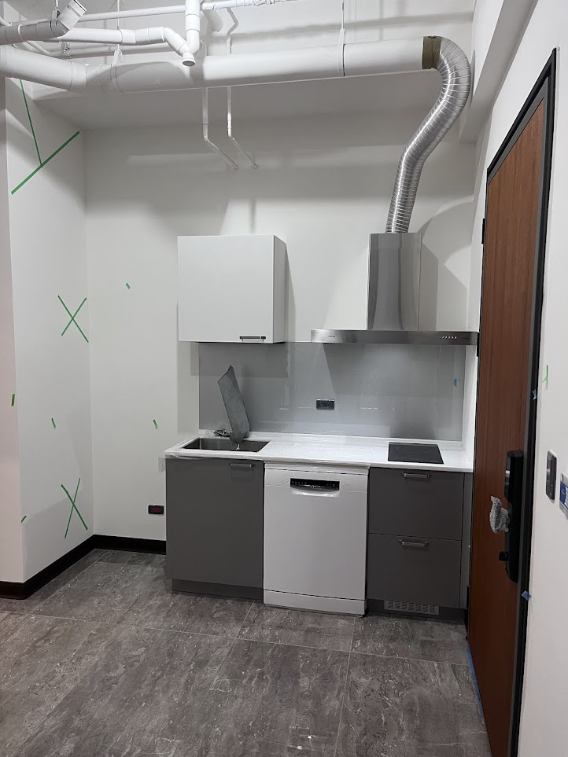

# AW — A房 西牆（廚房）
{: .no_toc }

  
目次

- TOC
{:toc}

## 基本資訊

| 項目 | 內容 |
|---|---|
| 尺寸 (寬 × 高) | — m × — m |
| 材質 | — |
| 相鄰空間 | — |
| 合約圖號 | — |

## 設計決策

### 磁吸收納牆（防濺板 / 牆面可調收納）

- [ ] **廚房牆面做磁吸功能** — 防濺板 / 牆面加整片薄鐵板（或內襯磁性底材），讓磁吸廚房小物可自由吸附、隨時調位置
- [ ] 候選系統：磁吸置物架、磁吸刀架、磁吸香料罐、磁吸餐巾紙架
- [ ] 飾面：**磁性黑板漆 / 磁性白板漆** 或鋼板 + 面材貼膜（視覺保持乾淨、不讓用戶看到金屬感）
- [ ] 覆蓋範圍：防濺板高度（檯面 → 吊櫃下緣）是否延伸到水槽 / 爐具側牆

### 冰箱散熱 + 新風系統整合

- **冰箱型號確認** — [Panasonic **NR-E507XT-W1** 輕暖白 · 502L](../references/products/#panasonic-nr-e507xt-w1--502l-日製五門變頻冰箱輕暖白)（NT$47,872，燦坤提貨券，需 2027/01/07 前換貨）
  - **外觀 W650 × D699 × H1828 mm** / 包裝箱 W712 × D796 × H1929 mm（搬運評估用）
- ✅ **冰箱位置 & 開門方向確定**：
  - **背靠 AW（西牆）**
  - **門朝東（右開）** — 開門淨空落在廚房區，不影響 AS / 客廳
  - 位置：AW 南端，靠 AS 角落
- ✅ **冰箱 ↔ AS 牆之間縫隙** 規劃為 **[AS↔DN 滑軌拉門的收納口袋](DN.md)** — 面北時拉門往**左（西）**收入此縫隙
  - AS / BN 整片牆保留完整，不挖拉門收納槽（牆面視覺乾淨）
  - 鏡面（固定在門扇 D 側）也一併收入縫隙，客廳與更衣區都看不見
  - [ ] **需實際評估冰箱空間是否可行**：縫隙水平長度要能容納**整扇門 + 鏡面**（門寬多少 → 縫隙需同寬）、縫隙垂直高度要容納鏡面高度
  - [ ] 縫隙淨深 ≥ 門扇厚 + 鏡面厚；上軌延伸進縫隙
  - ⚠️ **與抽拉窄櫃不能並存**（原先想放 pull-out pantry 的位置已改給拉門用）

### 冰箱下方架高（掃地機器人穿越 / 停靠）— 構想評估

> 構想：冰箱底部架高 10–15 cm，讓掃地機器人可穿越或停靠在下方 — 空間利用最大化。**可行性待與設計師 / 合豐評估**。

- [ ] **工程可行性**：冰箱重量約 90–110 kg（500L 級），架高底座需承重 + 防止側傾（建議 RC 小平台 / 不鏽鋼型鋼骨架 + 防震墊）
- [ ] **總高限制**：冰箱本體 H1828 + 架高 100–150 mm ≈ 總高 1930–1980 mm，需確認天花板淨高有足夠 clearance（含冰箱頂散熱 ≥ 50 mm）
- [ ] **保固影響**：Panasonic 原廠是否接受底部架高擺放？需與燦坤 / 原廠確認（避免影響保固）
- [ ] **掃地機器人高度**：一般 ≤ 10 cm（iRobot Roomba ≈ 9.2 cm / Roborock S 系列 ≈ 9.6 cm / Xiaomi ≈ 9.5 cm），**架高淨空建議 ≥ 11–12 cm**（預留誤差與未來升級空間）
- [ ] **散熱**：底部架高後需確認氣流走向（本機為**上置式壓縮機**，主要散熱在頂部，底部架高影響較小）— 但仍需避免底部積塵影響運轉
- [ ] **是否設置充電基座**：若機器人**停靠**於此（非僅穿越），需預留**插座 + 訊號可及**，且充電座深度不擋取用冰箱最下層抽屜
- [ ] **最下層冷凍抽屜取用**：冰箱底抽出時使用者是否需彎腰過深（架高後抽屜下緣會升高）— 需實測人體工學
- [ ] **底部防塵 / 清潔**：架高底下易積塵、貓毛、食物碎屑，需能用機器人定期清掃
- [ ] **備案**：若底部架高不可行，改為**側邊或地櫃下方設掃地機器人基地**

**進一步構想：架高底座加重型滑軌（冰箱可整體前推）**

- [ ] **用途**：平時冰箱固定，**需要清潔背後 / 側面 / 機器人卡住維修時**，把冰箱如大抽屜般往前推出 50–80 cm
- [ ] **滑軌規格**：重型滾珠滑軌，承載 ≥ 150 kg（冰箱本體 ~100 kg + 食物 + 動態拉力緩衝） — 候選品牌 Häfele、Accuride、Blum（廚房與工業用重型系列）
- [ ] **鎖定機構（防貓 / 防小孩）**：平時必須**鎖死**避免被推開
  - 方案 A：底部**大人才搆得到的手動卡榫 / Push-Lock**（小孩視線下方 + 需要蹲下推才能解開）
  - 方案 B：**鑰匙鎖 / 密碼鎖**（安全性高但開關麻煩）
  - 方案 C：滑軌內建**阻尼 + 安全鎖扣**（專業廚房滑軌常見，需要抬起 + 拉出的雙動作才會解鎖）
- [ ] **電源 / 冷媒管留長**：冰箱前推後，電源線 + 背後散熱接口 + 新風接口 需留足夠餘裕，避免拉扯
  - 可改為**插座裝在前推終點上方**（拉出時仍插著），或**捲線器** / 收縮式電纜管理
- [ ] **底座地面固定**：底座本身必須**鎖死地面**（不能整個底座滑動），只有冰箱在底座上滑
- [ ] **推出動線**：前方需淨空 ≥ 80 cm（平常不擋動線的前提下）— 配合 AW 一字型廚房走道
- [ ] **安全與防傾**：冰箱拉出最遠位置，重心仍需在底座上（不能前傾翻落）— 需做 **anti-tip 拉環 / 鍊條 / 止擋**
- [ ] **保固顧慮升級**：這等於改裝冰箱安裝方式，更需先跟 Panasonic / 燦坤確認**是否影響保固**（可能需要客製廚具而非直接放原廠基座）
- [ ] **冰箱後方散熱縫隙往上連通天花板新風系統** — 避免熱氣悶在冰箱背板，提升運轉效率
- [ ] 冰箱後方需預留散熱空隙（建議 5–10 cm）
- [ ] **縫隙需防貓鑽入** — 後方散熱通道用金屬細網封住（通風但貓不進）
- [ ] **天花板夾層也需防貓** — 冰箱頂 → 天花板新風通道沿線，所有人孔 / 維修口加擋板或網，避免貓爬上去卡住
- [ ] 新風系統送/回風點位置、風量，與冰箱散熱的相互影響
- [x] ~~量測冰箱外觀尺寸~~ — **W650 × D699 × H1828 mm**（NR-E507XT-W1 官方規格）
- [ ] 冰箱專用迴路 + 插座位置（配合 AW 靠 AS 側角落）

## 插座 / 開關

| 位置 (距地 / 距牆) | 類型 | 用途 | 狀態 |
|---|---|---|---|
| — | — | — | — |

## 燈具

- 主燈：
- 輔助：
- 開關位置：

## 櫃體 / 固定家具

- 尺寸：
- 材質 / 飾面：
- 五金：
- 內部配置：

## 現場照片

{: .hover-lightbox-trigger width="500" }

**AW 廚房配置 (已建置)**：
- 一字型小廚房：**水槽 + 1 口 IH 爐 + 抽油煙機 + 洗碗機** 全部已就位
- 上櫃：白色單門吊櫃（在爐具左上）, 水槽上櫃會拆除重新製作
- 下櫃：深灰色系，含洗碗機 + 抽屜
- 檯面：白色紋路（需確認是否大理石 / 石英石）
- 防濺板：白色紋路延伸到牆面
- 抽油煙機：不鏽鋼，排氣可撓管拉到天花板
- 天花板：**白色管路外露**（給排水 / 排氣 / 電氣）— 後續需要封板或走明管美化
- 地板：深灰石紋磁磚（與客廳 AE 區同一系列）
- 入戶門：右側深木色（廚房入口就是玄關側）
- 牆面有**綠色 X 記號**是驗屋公司標記牆壁瑕疵，待建商處理

**待討論**：
- [v] 天花板封板
- [v] 上櫃是否加長／加門（目前只有 1 座，儲物空間有限）
- [v] 側牆收納空間（冰箱位置、電器櫃）

## 參考產品 / 圖片

### ~~投影布幕~~（改掛 AE，不在 AW）

- ❌ **投影布幕改掛 [AE 側天花](AE/#ae-天花板客廳側)** — 與升降曬衣桿共用軌道，不用時捲起 + 曬衣桿升頂
- AW 側不再預留布幕內嵌盒，[估價 六-5 NT$8,075](../contract/estimate/#六木作工程) 項目移到 AE
- 詳見 [A 房 · 投影布幕](../rooms/A.md#ae-側天花升降曬衣桿--投影布幕共掛)

## 會議紀錄

- **YYYY-MM-DD** — 
