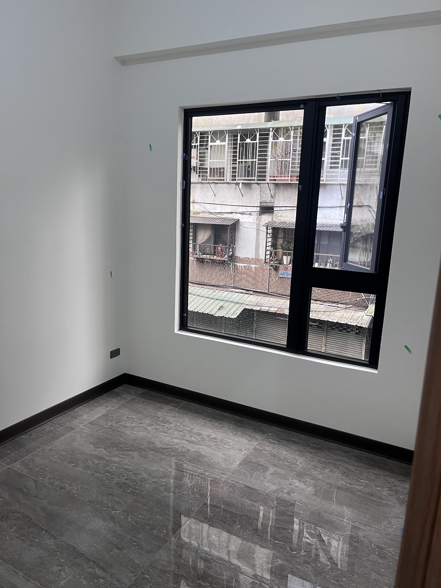

# BS — B房 南牆（主臥）
{: .no_toc }

  
目次

- TOC
{:toc}

## 基本資訊

| 項目 | 內容 |
|---|---|
| 尺寸 (寬 × 高) | — m × — m |
| 材質 | 建築外牆 + 黑框鋁窗 |
| 相鄰空間 | 建物外部（南向，面鄰舊棟） |
| 合約圖號 | — |

## 設計決策

### 對外窗 — 加大採光通風

✅ BS 為**對外窗**（見 [現場照片](#現場照片)：黑框方窗，僅右上一小段外推可開）。

- [ ] **評估將建商原窗換為更大可開啟面積款式**（橫拉改推射 / 增加開啟扇數等）— 對應 [B 房 · 建商窗戶加大](../rooms/B.md#建商窗戶加大採光通風)
- [ ] **前提**：不破壞建物外觀（黑色外框、玻璃樣式維持）
- [ ] 外窗下方窗台是否做**窗邊矮櫃 / 閱讀平台 / 坐臥窗**（結合主臥休憩情境）
- [ ] 景觀考量：外景為舊棟建物 + 鐵窗 → 搭配窗簾 / 霧化玻璃遮擋 vs 保留通風採光平衡

## 插座 / 開關

| 位置 (距地 / 距牆) | 類型 | 用途 | 狀態 |
|---|---|---|---|
| — | — | — | — |

## 燈具

- 主燈：
- 輔助：
- 開關位置：

## 櫃體 / 固定家具

- 尺寸：
- 材質 / 飾面：
- 五金：
- 內部配置：

## 現場照片

{: .hover-lightbox-trigger width="500" }

**觀察**：
- **黑色鋁框方窗**，**只有右上一小段可外推開啟**（左側與下方為固定窗 + 紗網）→ 正是 [建商窗戶加大](../rooms/B.md#建商窗戶加大採光通風) 需處理的典型狀況
- 牆面白漆、踢腳線深色收邊（與客廳同調）
- 地板為**深灰石紋磁磚**（與 A 客廳同系列）
- 左下有插座 + 面板
- 牆上綠色 X 標記為**驗屋瑕疵**，待建商修繕
- **外景**：鄰棟舊公寓 + 鐵窗 → 景觀有限，需靠窗簾或霧玻璃處理私密

## 會議紀錄

- **YYYY-MM-DD** — 
