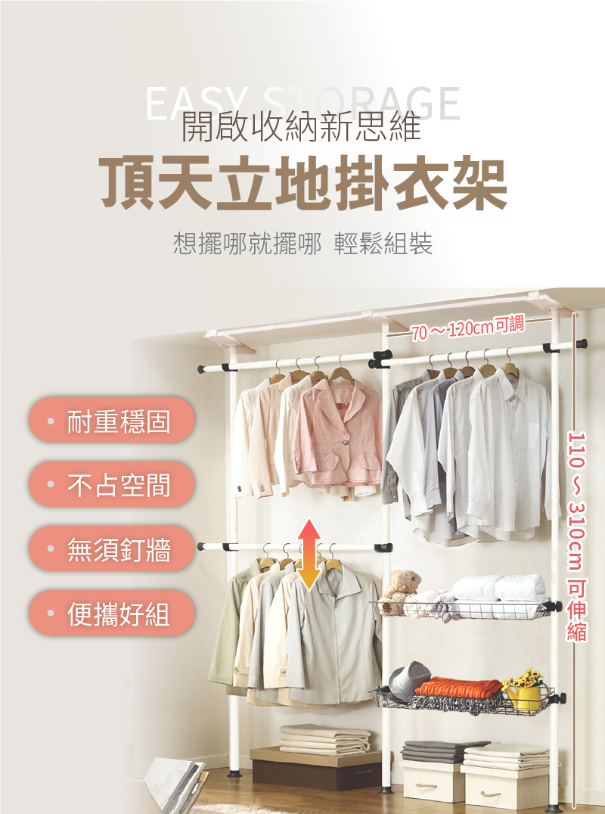

# BW — B房 西牆（主臥→衛浴）
{: .no_toc }

  
目次

- TOC
{:toc}

## 基本資訊

| 項目 | 內容 |
|---|---|
| 尺寸 (寬 × 高) | — m × — m |
| 材質 | — |
| 相鄰空間 | — |
| 合約圖號 | — |

## 設計決策

**B 房衣櫃牆** — 主臥的衣物收納，與 [BE 的 LD002 翻轉床](BE) 分工互補。

- [ ] **模組化開放式壁面收納** — 立柱軌道 + 可調層板、吊衣桿、金屬網籃抽屜（類似 IKEA BOAXEL / Elfa / Algot 系統）
- [ ] 木色層板 + 白色立柱 / 五金
- [ ] 分區規劃：高層吊掛、中層層板、下層網籃抽屜、工作檯面
- [v] 需要加門片
- [ ] 立柱軌道與 RC 牆體的固定方式（膨脹螺絲 / 背板）

## 插座 / 開關

| 位置 (距地 / 距牆) | 類型 | 用途 | 狀態 |
|---|---|---|---|
| — | — | — | — |

## 燈具

- 主燈：
- 輔助：
- 開關位置：

## 櫃體 / 固定家具

- 尺寸：
- 材質 / 飾面：
- 五金：
- 內部配置：

## 現場照片

<!--  -->

## 參考產品 / 圖片

### 模組化壁面收納 (modular wall shelving)

{: .hover-lightbox-trigger width="600" }

- **型式**：白色立柱軌道 + 可調木色層板 + 吊衣桿 + 金屬網籃抽屜
- **優點**：高度 / 間距可隨時調整、白色五金視覺輕量、木層板暖色平衡
- **類似系統**：IKEA BOAXEL、Elfa（The Container Store）、Algot、String Furniture
- **注意**：後續加門

### 頂天立地掛衣架（現成商品參考）

{: .hover-lightbox-trigger width="400" }

**參考商品**：[momo 頂天立地掛衣架](https://www.momoshop.com.tw/TP/TP0006580/goodsDetail/TP00065800000128)（寬 70–120 cm 可調 / 高 110–310 cm 可伸縮 / 無須釘牆 / 雙吊衣桿 + 網籃）

- **型式**：張力式頂天立地雙立柱 + 雙層吊衣桿 + 網籃抽屜
- **符合本案概念**：雙層吊桿（上長衣、下短衣）+ 下方網籃（收鞋 / 毛毯）— 對應本案 BW 「高層吊掛、中層層板、下層網籃抽屜」分層規劃
- **可借用的設計語彙**：
  - 雙層吊桿的**上下分工**（長衣 / 短衣 + 折疊衣）
  - 下方**金屬網籃抽屜**用於收納鞋、毛毯、換季物
  - 白色立柱視覺輕量，不壓迫小房間
- **跟自製版本的差異**：
  - BW 為整面牆，寬度遠超過 120 cm，商品規格不夠
  - 正式版會**鎖牆 + 加門片**（見設計決策），不是張力式
  - 建議以 **IKEA BOAXEL / Elfa 系統**實現相同分層邏輯但整面覆蓋

## 會議紀錄

- **YYYY-MM-DD** — 
