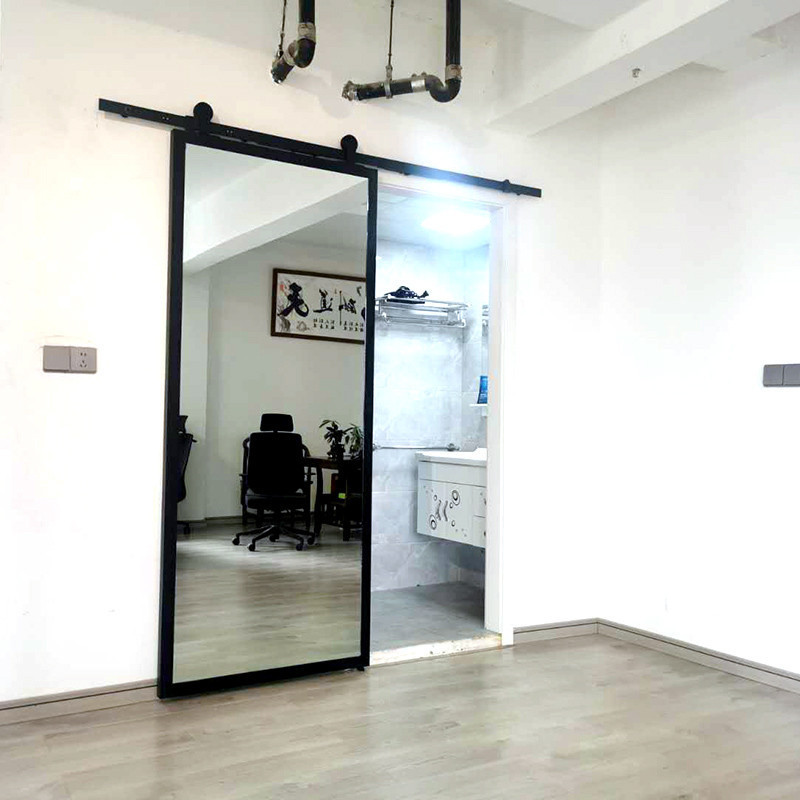
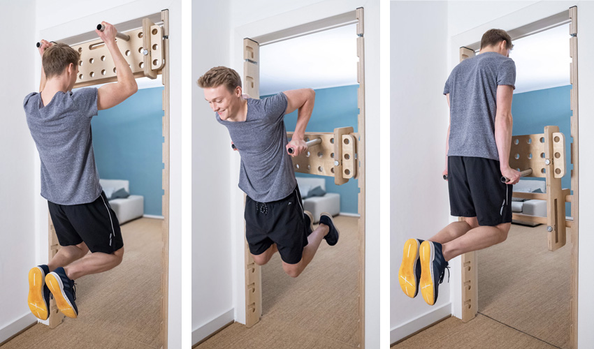

# DN — D房 北牆（衛浴）
{: .no_toc }

  
目次

- TOC
{:toc}

## 基本資訊

| 項目 | 內容 |
|---|---|
| 尺寸 (寬 × 高) | — m × — m |
| 材質 | — |
| 相鄰空間 | — |
| 合約圖號 | — |

## 設計決策

- [ ] **門框改造成木製引體向上/健身架** — 兩側立柱為鑽孔板（類似 pegboard），可插橫桿做引體向上、雙槓撐體、抬腿等動作
- [ ] 確認門框改造後的門扇仍能正常開關（或改無門設計）
- [ ] 立柱深度、孔距、結構承重（需能承受動態體重負荷）
- [ ] 與設計師討論木材選擇 / 飾面與浴室潮濕環境的相容性

### AS ↔ DN 滑軌拉門（D 側整面穿衣鏡 + B/C 共用更衣區）

- [ ] 拉門與 [AS 頁](AS) 相連 — 分隔客廳與臥室 / 衛浴側
- [ ] **只做上方滑軌**（吊掛式），**不做地面軌道**
- [ ] **D 側 = 整面穿衣鏡**（full-length） — 同時作為 [B 房](../rooms/B) 與 [C 房](../rooms/C) 的**共用更衣區**
- [ ] **門開時 = 鏡面收進 AS 牆後** — 拉門打開時貼合 AS 牆背面，鏡面夾在門與 AS 之間，客廳側看不到鏡子，整面牆視覺乾淨
- [ ] **門關時 = 露出鏡面** — 形成更衣區，供 B / C 使用
- [ ] **鏡周邊補光** — 上方 / 兩側 LED 條，色溫建議偏中性白（3500–4000 K）均勻照臉，避免頂光陰影
- [ ] 鏡面與門扇固定為同一體（隨門滑動）
- [ ] 防霧 / 抗指紋塗層（靠近 D 衛浴側，蒸氣影響）
- [ ] 門前（alley 空間）保留 60–80 cm 淨空作為更衣動線
- [ ] 拉門收納槽深度與 AS 牆厚度需同步規劃

## 插座 / 開關

| 位置 (距地 / 距牆) | 類型 | 用途 | 狀態 |
|---|---|---|---|
| — | — | — | — |

## 燈具

- 主燈：
- 輔助：
- 開關位置：

## 櫃體 / 固定家具

- 尺寸：
- 材質 / 飾面：
- 五金：
- 內部配置：

## 現場照片

<!--  -->

## 參考產品 / 圖片

### AS ↔ DN 滑軌拉門 + 整面穿衣鏡參考

{: .hover-lightbox-trigger width="500" }

**符合本案需求的關鍵**：
- ✅ **只有上方滑軌**（穀倉門 barn-door 式），地面無軌道
- ✅ **整面穿衣鏡 + 深色金屬外框**
- ✅ 門扇等於一面獨立鏡面牆（非隔間牆的一部分）
- ✅ 滑開時露出後方空間（示意圖中露出衛浴）

**跟設計師討論**：
- [ ] 框色：示意圖為黑色金屬 — 是否要搭配室內其他硬體顏色
- [ ] 軌道懸吊機構：穀倉門滾輪 vs 隱藏式 U 軌（後者更乾淨但較貴）
- [ ] 門扇高度（是否做到頂天）

### 門框健身架 (pullup doorframe)

{: .hover-lightbox-trigger width="600" }

- **型式**：木製門框兩側立柱帶孔板，橫桿可插入不同高度
- **動作**：引體向上、雙槓撐體（dip）、懸吊抬腿
- **類似商品關鍵字**：NOHrD SlimBeam、Pinofit Pullup、wall-mounted wooden pull-up bar

## 會議紀錄

- **YYYY-MM-DD** — 
