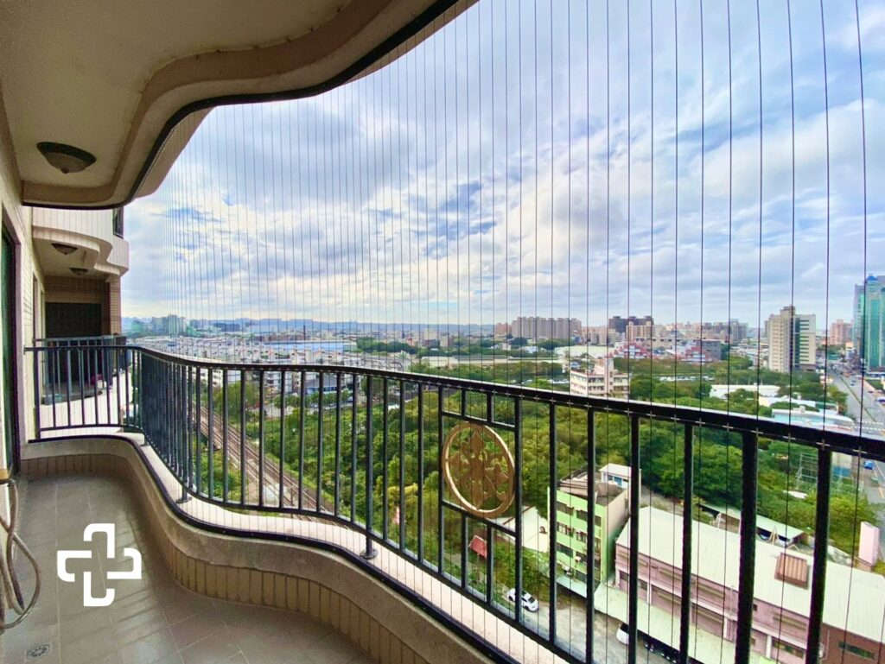

# FE — F房 東牆（陽台外側）
{: .no_toc }

  
目次

- TOC
{:toc}

## 基本資訊

| 項目 | 內容 |
|---|---|
| 尺寸 (寬 × 高) | — m × — m |
| 材質 | 玻璃欄杆 + 黑色金屬扶手（現況）|
| 相鄰空間 | 建物外部（東向，最外側） |
| 合約圖號 | — |

## 設計決策

### 隱形鐵窗（貓安全 + 透氣通風）

- [ ] **全面安裝直立式隱形鐵窗**（鋼絲 / 不鏽鋼垂直細條）— 讓貓可以靠近欄杆吹風、曬太陽，但**無法鑽出或跳出**陽台
- [ ] **樣式**：
  - **直立式鋼絲**（細金屬線垂直拉緊 + 上下端固定在金屬軌）— 最常見的「隱形鐵窗」，視覺穿透、不擋視線
  - 線距：**≤ 6 cm**（成貓頭寬不可通過）
  - 顏色：黑色（與現有玻璃欄杆黑框 + 黑金屬扶手呼應）
- [ ] **高度**：頂端需超過欄杆頂，甚至接近天花板 / 屋簷（避免貓從扶手上跳出）
- [ ] **固定方式**：上下軌道鎖在結構體（地板 + 天花板 / 屋簷梁）— 不鎖玻璃欄杆面板
- [ ] **不影響洗曬**：安裝位置不擋到 [三層配置](../rooms/F.md#三層垂直堆疊配置) 或曬衣動線
- [ ] **不影響逃生**：若是法規要求的逃生口，需保留可開啟段（可上鎖但人能快速打開）
- [ ] **候選廠商**：隱形鐵窗專業廠（如「貓防護網」「隱形鐵窗施工」類業者），需看現場丈量報價

### 其他

- [ ] 是否整合晾曬桿 / 小層架於鐵窗結構（加強功能性）

## 參考產品 / 圖片

### 直立式隱形鐵窗（barn-style vertical wire grid）

{: .hover-lightbox-trigger width="600" }

**示意重點**：
- **垂直細鋼索**由**地板**拉到**上方樑 / 屋簷**（整面落地到頂），線距密集
- 安裝在既有欄杆**外側 / 上方**，完全蓋過欄杆頂端 → 貓無法從扶手跳出
- 視覺穿透、遠看幾乎不影響景觀 → 故稱「隱形」
- 黑色鋼索 + 黑色上下軌，與本案現有黑色金屬扶手 + 玻璃欄杆視覺一致

**對應本案**：
- [ ] 鋼索需**蓋過玻璃欄杆頂 + 黑金屬扶手**，貓不能從扶手上起跳翻越
- [ ] 上軌固定於陽台天花板 / 屋簷梁（不鎖玻璃欄杆）
- [ ] 下軌固定於地板（或沿陽台結構邊緣）
- [ ] 線距 **≤ 6 cm**（成貓頭寬限制）

## 現場照片

參考 [F 房現場照片](../rooms/F.md#現場照片)（玻璃欄杆 + 黑色扶手為現況）。

## 會議紀錄

- **YYYY-MM-DD** — 
