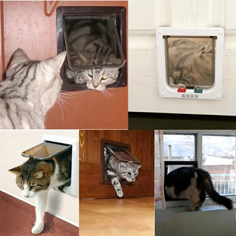

# FW — F房 西牆（陽台→客廳，共用 AE）
{: .no_toc }

  
目次

- TOC
{:toc}

## 基本資訊

| 項目 | 內容 |
|---|---|
| 尺寸 (寬 × 高) | — m × — m |
| 材質 | 黑框落地推拉 / 摺疊門 + 紗網（與 [AE](AE) 為同一物理元件） |
| 相鄰空間 | 西側 = [A 客廳](../rooms/A)（[AE](AE) 的陽台面） |
| 合約圖號 | — |

## 設計決策

本頁描述 **陽台側（F）** 的決策；[客廳側（A）](AE) 見 AE 頁。

### 貓門

- [ ] **門上或門側增設貓門** — 貓能自由進出陽台
  - 候選位置：推拉門下緣改裝貓門，或門旁牆面加獨立貓門
  - 需避免與人類動線衝突
  - 夜間 / 旅行可鎖閉的選項
- [ ] 貓門尺寸（現行成貓通過所需最小）
- [ ] 貓門材質 / 密封性（防雨 / 防風 / 隔音）

### 陽台側細節

- [ ] 門檻高低 — 室內外高差 + 防水條（避免雨水倒灌入客廳）
- [ ] 門扇紗網朝向（紗網在 F 側還是 A 側）
- [ ] 門把操作性（從陽台也能方便開）

## 參考產品 / 圖片

### 貓門（4 段鎖 cat flap）

{: .hover-lightbox-trigger width="450" }

**參考商品**：[樂天 linzhishe · 四段鎖寵物門](https://www.rakuten.com.tw/shop/linzhishe/product/p675062165013/)

**型式**：透明翻板 + 塑膠外框 + **4 段鎖**（自由進出 / 只進不出 / 只出不進 / 完全鎖閉）

**符合本案需求**：
- ✅ 翻板輕量，貓可自由推開
- ✅ 旋鈕式 4 段鎖可控制進出方向（旅行 / 夜間可鎖閉）
- ✅ 開孔大小成貓可通過（需依貓體型選 S / M / L）

**安裝選項**：
- **A. 在 AE/FW 落地門上開孔** — 需找配合玻璃 / 鋁門施工的師傅，**不可逆**
- **B. 門旁側牆獨立開洞安裝** — 保留原門完整，需牆厚足夠
- **C. 在門扇下段加裝**（若門扇可開大洞）

**待確認**：
- [ ] A / B / C 哪種安裝方式（需與設計師 + 門窗廠商討論）
- [ ] 貓門顏色：**黑色**（呼應現場黑框玻璃欄杆 + 黑金屬扶手）— 一般款多白色，可能需客製或選烤漆款
- [ ] 尺寸：依貓體型選 S / M / L
- [ ] 防雨防風（朝陽台側的防水膠條）

## 現場照片

參考 [AE 頁的門實景](AE#現場照片)。

## 會議紀錄

- **YYYY-MM-DD** — 
